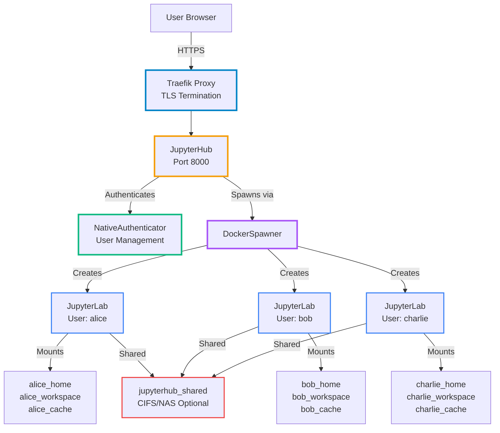
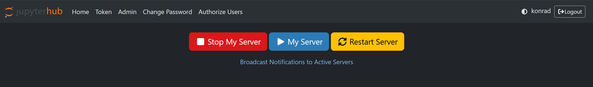
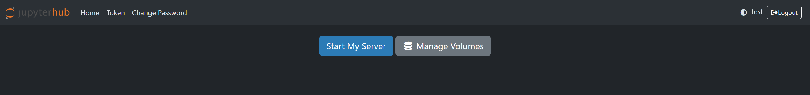
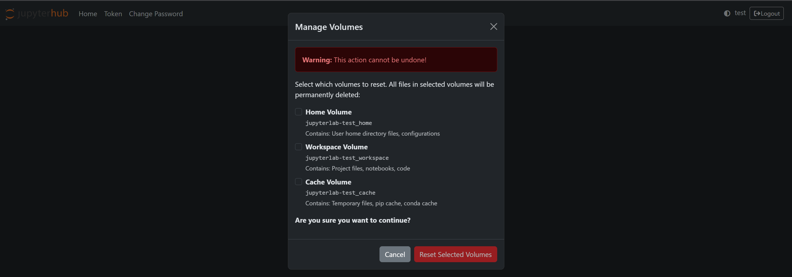
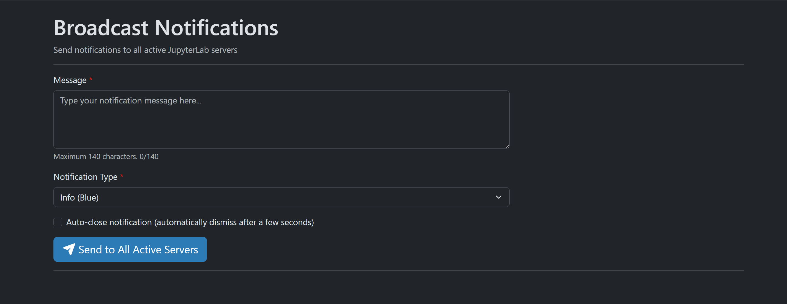

# Stellars JupyterHub for Data Science Platform


**Multi-user JupyterHub 4 with Miniforge, Data Science stack, and NativeAuthenticator.**

This platform is built to support multiple data scientists on a shared environment with isolated sessions. Powered by JupyterHub, it ensures secure, user-specific access via the `NativeAuthenticator` plugin. It includes a full data science stack with GPU support (optional), and integrates seamlessly into modern Docker-based workflows.

By default system is capable of **automatically detecting** NVIDIA CUDA-supported GPU

This deployment provides access to a centralized JupyterHub instance for managing user sessions. Optional integrations such as TensorBoard, MLFlow, or Optuna can be added manually via service extensions.

## Architecture



Users access JupyterHub through Traefik reverse proxy with TLS termination. After authentication via NativeAuthenticator, JupyterHub spawns isolated JupyterLab containers per user using DockerSpawner. Each user gets dedicated persistent volumes for home directory, workspace files, and cache data, with optional shared storage for collaborative datasets.

## User Interface

**User Control Panel**

User control panel with server restart and volume management options.



**Volume Management**

Access volume management when server is stopped.



**Volume Selection**

Select individual volumes to reset - home directory, workspace files, or cache data.



**Admin Notification Broadcast**

Admin panel for broadcasting notifications to all active JupyterLab servers.



## Features

- **GPU Auto-Detection**: Automatic NVIDIA CUDA GPU detection and configuration for spawned user containers
- **Notification Broadcast**: Admins can send notifications to all active JupyterLab servers simultaneously through the integrated notification panel at `/hub/notifications`. Supports multiple notification types (info, success, warning, error), 140-character messages, and dismiss buttons. Requires [jupyterlab_notifications_extension](https://github.com/stellarshenson/jupyterlab_notifications_extension) installed on spawned JupyterLab servers
- **User Self-Service**: Users can restart their JupyterLab containers and selectively reset persistent volumes (home/workspace/cache) without admin intervention
- **Privileged Access Control**: Group-based docker.sock access for trusted users enabling container orchestration from within JupyterLab
- **Isolated Environments**: Each user gets dedicated JupyterLab container with persistent volumes via DockerSpawner
- **Native Authentication**: Built-in user management with NativeAuthenticator supporting self-registration and admin approval
- **Shared Storage**: Optional CIFS/NAS mount support for shared datasets across all users
- **Production Ready**: Traefik reverse proxy with TLS termination, automatic container updates via Watchtower

## References

This project spawns user environments using docker image: `stellars/stellars-jupyterlab-ds`

Visit the project page for stellars-jupyterlab-ds: https://github.com/stellarshenson/stellars-jupyterlab-ds

## Requirements

**Docker Socket Access Required**: This JupyterHub implementation requires read-write access to the Docker socket (`/var/run/docker.sock`) mounted into the JupyterHub container. This is essential for:

- **DockerSpawner**: Spawning and managing isolated JupyterLab containers for each user
- **Volume Management**: Allowing users to reset their persistent volumes (home/workspace/cache)
- **Container Control**: Enabling server restart functionality from the user control panel
- **Privileged Access**: Supporting optional docker.sock access for trusted users within their JupyterLab environments

The `compose.yml` file includes this mount by default:
```yaml
volumes:
  - /var/run/docker.sock:/var/run/docker.sock:rw
```

**Security Note**: The JupyterHub container has full access to the Docker daemon. Ensure the host system is properly secured and only trusted administrators have access to JupyterHub configuration.

## Quickstart

### Docker Compose
1. Download `compose.yml` and `config/jupyterhub_config.py` config file
2. Run: `docker compose up --no-build`
3. Open https://localhost/jupyterhub in your browser 
4. Add `admin` user through self-sign-in (user will be authorised automatically)
5. Log in as `admin`

### Start Scripts
- `start.sh` or `start.bat` – standard startup for the environment
- `scripts/build.sh` alternatively `make build` – builds required Docker containers

### Authentication
This stack uses [NativeAuthenticator](https://github.com/jupyterhub/nativeauthenticator) for user management. Admins can whitelist users or allow self-registration. Passwords are stored securely.


## Deployment Notes

- Ensure `config/jupyterhub_config.py` is correctly set for your environment (e.g., TLS, admin list).
- Optional volume mounts and configuration can be modified in `jupyterhub_config.py` for shared storage.

## Customisation

You should customise the deployment by creating a `compose_override.yml` file.  

#### Custom configuration file
Example below introduces custom config file `jupyterhub_config_override.py` to use for your deployment:

```yaml
services:
  jupyterhub:
    volumes:
      - ./config/jupyterhub_config_override.py:/srv/jupyterhub/jupyterhub_config.py:ro # config file (read only)
```

#### Enable GPU

No changes required in the configuration if you allow NVidia autodetection to be performed.
Otherwise change the `ENABLE_GPU_SUPPORT = 1`

Changes in your `compose_override.yml`:
```yaml
services:
  jupyterhub:
    environment:
      - ENABLE_GPU_SUPPORT=1 # enable NVIDIA GPU, values: 0 - disabled, 1 - enabled, 2 - auto-detect
```

#### Enable shared CIFS mount

Changes in your `compose_override.yml`:
```yaml
  jupyterhub:
    volumes:
      - ./config/jupyterhub_config_override.py:/srv/jupyterhub/jupyterhub_config.py:ro # config file (read only)
      - jupyterhub_shared_nas:/mnt/shared # cifs share
    
volumes:
  # remote drive for large datasets
  jupyterhub_shared_nas:
    driver: local
    name: jupyterhub_shared_nas
    driver_opts:
      type: cifs
      device: //nas_ip_or_dns_name/data
      o: username=xxxx,password=yyyy,uid=1000,gid=1000
```

in the config file you will refer to this volume by its name `jupyterhub_shared_nas`:

```python
# User mounts in the spawned container
c.DockerSpawner.volumes = {
    "jupyterlab-{username}_home": "/home",
    "jupyterlab-{username}_workspace": DOCKER_NOTEBOOK_DIR,
    "jupyterlab-{username}_cache": "/home/lab/.cache",
    "jupyterhub_shared_nas": "/mnt/shared"
}
```

#### Grant Docker Socket Access to Privileged Users

**Security Warning**: Docker socket access grants effective root-level control over the host system. Only grant this permission to trusted users.

The platform supports granting specific users read-write access to `/var/run/docker.sock` within their JupyterLab containers. This enables container orchestration, Docker builds, and Docker Compose operations from within user environments.

**How to Grant Access**:

1. Log in as admin and navigate to Admin Panel (`https://localhost/jupyterhub/hub/admin`)
2. Click "Groups" in the navigation
3. Click on the `docker-privileged` group (automatically created at startup)
4. Add users who need docker.sock access to this group
5. Users must restart their server (Stop My Server -> Start My Server) for changes to take effect

**Technical Details**:

The `docker-privileged` group is a built-in protected group that cannot be permanently deleted. It is automatically created at JupyterHub startup and recreated before every container spawn if missing. A pre-spawn hook (`config/jupyterhub_config.py::pre_spawn_hook`) checks user group membership before spawning containers. Users in the `docker-privileged` group will have `/var/run/docker.sock` mounted with read-write permissions in their JupyterLab environment.

**Use Cases**:
- Building custom Docker images from within JupyterLab
- Running Docker Compose stacks for local development
- Container orchestration and management tasks
- Advanced DevOps workflows requiring Docker API access

<!-- EOF -->
