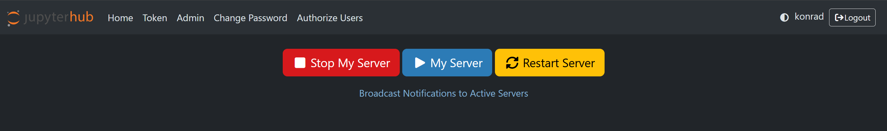
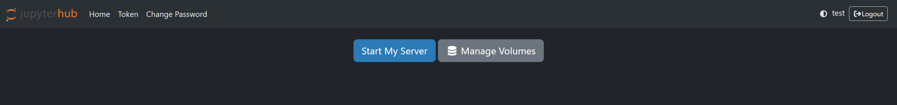
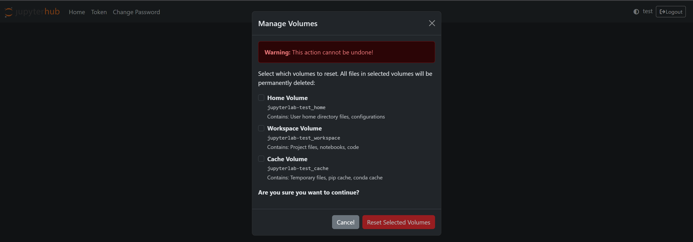
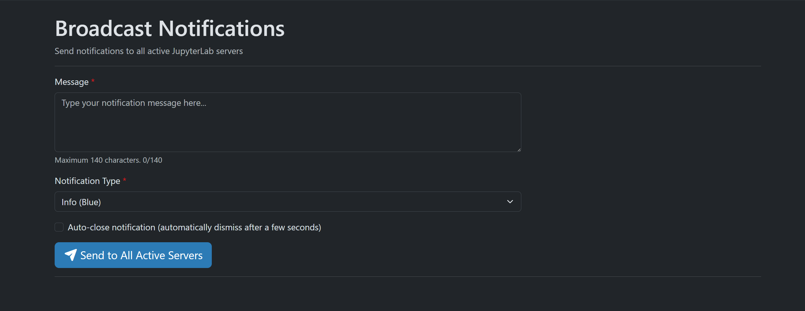
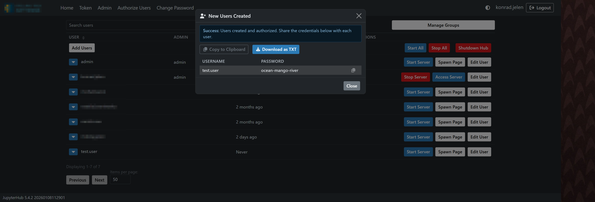
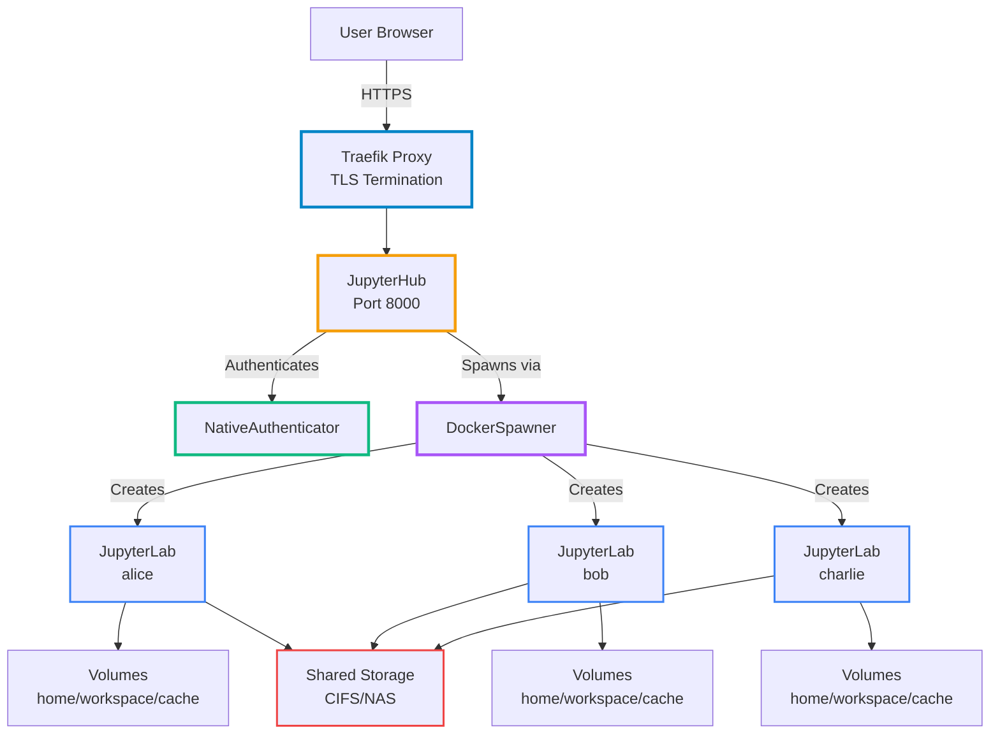
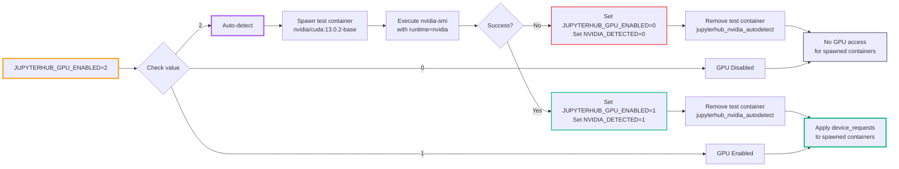
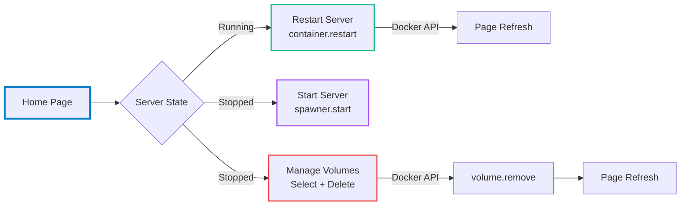
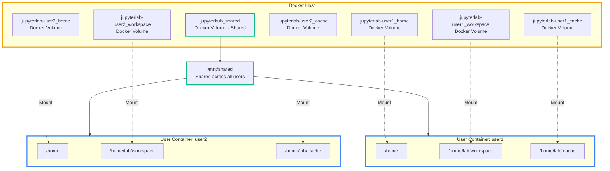

# Stellars JupyterHub for Data Science Platform


[](https://kolomolo.com)
[](https://www.paypal.com/donate/?hosted_button_id=B4KPBJDLLXTSA)

Multi-user JupyterHub 4 deployment platform with data science stack, GPU support, and NativeAuthenticator. The platform spawns isolated JupyterLab environments per user using DockerSpawner, backed by the [stellars/stellars-jupyterlab-ds](https://hub.docker.com/r/stellars/stellars-jupyterlab-ds) image (from [stellars-jupyterlab-ds](https://github.com/stellarshenson/stellars-jupyterlab-ds) project).

## Features

- **GPU Auto-Detection**: Automatic NVIDIA CUDA GPU detection and configuration for spawned user containers
- **Notification Broadcast**: Admin broadcast to all active servers via `/hub/notifications`. Supports six notification types, 140-character limit. Requires [jupyterlab_notifications_extension](https://github.com/stellarshenson/jupyterlab_notifications_extension)
- **User Self-Service**: Users can restart their JupyterLab containers and selectively reset persistent volumes (home/workspace/cache) without admin intervention
- **Admin Volume Management**: Admins can manage any user's volumes directly from the admin panel via database icon button in each user row
- **Group Configuration**: Dedicated `/hub/groups` admin page managing user groups with per-group configuration: custom environment variables, GPU access, Docker engine / privileged container access, and memory limit in GB. User access is resolved at spawn time by collapsing all of the user's groups - grants (GPU / Docker / privileged) OR-accumulate, env vars use highest-priority wins on conflict, memory limit uses biggest-value wins (disabled groups do not un-cap). Reserved env var names (`JUPYTERHUB_*` / `JPY_*` / `MEM_*` / `CPU_*` plus platform defaults) are rejected with an inline error message. Drag-and-drop row reorder plus move-up / move-down buttons set the priority. Group membership managed via the stock JupyterHub admin panel now shows a post-Apply confirmation modal listing added and removed users per group
- **Docker Access Control**: Per-group Docker engine access (`/var/run/docker.sock` mount) and privileged container mode, configured via the Groups admin page
- **Isolated Environments**: Each user gets dedicated JupyterLab container with persistent volumes via DockerSpawner
- **Native Authentication**: Built-in user management with NativeAuthenticator supporting optional self-registration (`JUPYTERHUB_SIGNUP_ENABLED`) and admin approval. Authorization page protects existing users from accidental discard - only pending signup requests can be discarded
- **Admin User Creation**: Batch user creation from admin panel with auto-generated mnemonic passwords (e.g., `storm-apple-ocean`). Credentials modal with copy/download options
- **Shared Storage**: Optional CIFS/NAS mount support for shared datasets across all users
- **Idle Server Culler**: Automatic shutdown of inactive servers after configurable timeout (default: 24 hours). Frees resources when users leave servers running
- **Activity Monitor**: Admin-only dashboard showing real-time CPU/memory usage, volume sizes with per-volume breakdown, 3-state status indicator (active/inactive/offline), and historical activity scoring with exponential decay
- **Mobile Interface**: Server management from mobile devices - status strip with pulsating indicator and uptime, inline session extension slider, admin activity monitor with card-based layout, health check with auto-reload on state change. No JupyterLab navigation - start/stop/restart only
- **Health Check Endpoint**: Unauthenticated `GET /hub/health` returning JSON with hub status, uptime, version, and active server count. Rate-limited to 1 req/s per IP. Designed for Zabbix, Prometheus, or other monitoring agents
- **Production Ready**: Traefik reverse proxy with TLS termination, automatic container updates via Watchtower

## User Interface

**User Control Panel**

User control panel with server restart and volume management options.



**Volume Management**

Access volume management when server is stopped.



**Volume Selection**

Select individual volumes to reset - home directory, workspace files, or cache data.



**Admin Notification Broadcast**

Admin panel for broadcasting notifications to all active JupyterLab servers.



**New User Credentials**

Admin creates users via Add Users form - credentials modal displays auto-generated mnemonic passwords.




## Architecture


```mermaid
graph TB
    User[User Browser] -->|HTTPS| Traefik[Traefik Proxy<br/>TLS Termination]
    Traefik --> Hub[JupyterHub<br/>Port 8000]

    Hub -->|Authenticates| Auth[NativeAuthenticator]
    Hub -->|Spawns via| Spawner[DockerSpawner]

    Spawner -->|Creates| Lab1[JupyterLab<br/>alice]
    Spawner -->|Creates| Lab2[JupyterLab<br/>bob]
    Spawner -->|Creates| Lab3[JupyterLab<br/>charlie]

    Lab1 --> Vol1[Volumes<br/>home/workspace/cache]
    Lab2 --> Vol2[Volumes<br/>home/workspace/cache]
    Lab3 --> Vol3[Volumes<br/>home/workspace/cache]

    Lab1 --> Shared[Shared Storage<br/>CIFS/NAS]
    Lab2 --> Shared
    Lab3 --> Shared

    style Hub stroke:#f59e0b,stroke-width:3px
    style Traefik stroke:#0284c7,stroke-width:3px
    style Auth stroke:#10b981,stroke-width:3px
    style Spawner stroke:#a855f7,stroke-width:3px
    style Lab1 stroke:#3b82f6,stroke-width:2px
    style Lab2 stroke:#3b82f6,stroke-width:2px
    style Lab3 stroke:#3b82f6,stroke-width:2px
    style Shared stroke:#ef4444,stroke-width:2px
```

Users access JupyterHub through Traefik reverse proxy with TLS termination. After authentication via NativeAuthenticator, JupyterHub spawns isolated JupyterLab containers per user using DockerSpawner. Each user gets dedicated persistent volumes for home directory, workspace files, and cache data, with optional shared storage for collaborative datasets.

## Configuration Flow


```mermaid
graph TB
    subgraph ENV["Environment Variables (compose.yml)"]
        ADMIN[JUPYTERHUB_ADMIN<br/>Admin username]
        BASEURL[JUPYTERHUB_BASE_URL<br/>URL prefix]
        IMG[JUPYTERHUB_NOTEBOOK_IMAGE<br/>User container image]
        NET[JUPYTERHUB_NETWORK_NAME<br/>Container network]
        SSL[JUPYTERHUB_SSL_ENABLED<br/>0=off, 1=on]
        GPU[JUPYTERHUB_GPU_ENABLED<br/>0=off, 1=on, 2=auto]
        SIGNUP[JUPYTERHUB_SIGNUP_ENABLED<br/>0=admin-only, 1=self-register]
        TFLOG[TF_CPP_MIN_LOG_LEVEL<br/>TensorFlow verbosity]
        NVIMG[JUPYTERHUB_NVIDIA_IMAGE<br/>CUDA test image]

        subgraph SVCEN["JUPYTERHUB_SERVICE_*<br/>Passed to Lab as env"]
            direction LR
            MLF[JUPYTERHUB_SERVICE_MLFLOW]
            RES[JUPYTERHUB_SERVICE_RESOURCES_MONITOR]
            TNS[JUPYTERHUB_SERVICE_TENSORBOARD]
            SVC_MORE[...]
        end
    end

    subgraph CONFIG["jupyterhub_config.py"]
        AUTH[NativeAuthenticator<br/>open_signup=False]
        SPAWN[DockerSpawner<br/>spawner_class, remove=True]
        NBDIR[DOCKER_NOTEBOOK_DIR<br/>/home/lab/workspace]
        VOLS[DOCKER_SPAWNER_VOLUMES<br/>home/workspace/cache/shared]
        VOLDESC[VOLUME_DESCRIPTIONS<br/>Optional UI labels]
        GROUPS[BUILTIN_GROUPS<br/>docker-sock, docker-privileged]
        HOOK[pre_spawn_hook<br/>Group check + privileges]
        HANDLERS[extra_handlers<br/>ManageVolumes, RestartServer, Notifications]
        TEMPLATES[template_paths<br/>Custom + Native + Default]
    end

    subgraph RUNTIME["Spawned User Container"]
        LAB[JupyterLab Server<br/>Port 8888]
        SERVICES[Services: MLflow, Glances, TensorBoard<br/>Controlled by ENABLE_SERVICE_* env]
        GPUACCESS[GPU Access<br/>device_requests if enabled]
    end

    ADMIN --> AUTH
    SIGNUP --> |enable_signup| AUTH
    BASEURL --> CONFIG
    IMG --> SPAWN
    NET --> SPAWN
    SSL --> CONFIG
    TFLOG --> |Passed as env| LAB
    NVIMG --> |Used for auto-detect| CONFIG

    GPU --> |Auto-detect via nvidia-smi| SPAWN
    GPU --> |Passed as env| LAB
    GPU --> |device_requests| GPUACCESS

    SVCEN --> |Passed as env| LAB
    SVCEN --> |Controls startup| SERVICES

    AUTH --> |Validates| SPAWN
    SPAWN --> |Creates| LAB
    NBDIR --> SPAWN
    VOLS --> |Mounts| LAB
    VOLDESC --> HANDLERS
    GROUPS --> HOOK
    HOOK --> |Conditionally mounts<br/>docker.sock| LAB
    HANDLERS --> |API endpoints| LAB
    TEMPLATES --> |Custom UI| LAB

    style ENV stroke:#f59e0b,stroke-width:3px
    style SVCEN stroke:#a855f7,stroke-width:2px
    style CONFIG stroke:#10b981,stroke-width:3px
    style RUNTIME stroke:#3b82f6,stroke-width:3px
    style HOOK stroke:#ef4444,stroke-width:2px
    style HANDLERS stroke:#ef4444,stroke-width:2px
```

Environment variables defined in `compose.yml` are consumed by `config/jupyterhub_config.py` to configure authentication, spawner behavior, and GPU detection. The configuration defines `DOCKER_SPAWNER_VOLUMES` for persistent storage, `VOLUME_DESCRIPTIONS` for optional UI labels, and `BUILTIN_GROUPS` for protected group management. When spawning user containers, these settings control which services are enabled (MLflow, Glances, TensorBoard), whether GPU access is granted via `device_requests`, and what volumes are mounted. The pre-spawn hook checks user group membership against `BUILTIN_GROUPS` to conditionally mount docker.sock for privileged users.

## GPU Auto-Detection


```mermaid
graph LR
    START[JUPYTERHUB_GPU_ENABLED=2] --> CHECK{Check value}
    CHECK -->|0| DISABLED[GPU Disabled]
    CHECK -->|1| ENABLED[GPU Enabled]
    CHECK -->|2| DETECT[Auto-detect]

    DETECT --> SPAWN[Spawn test container<br/>nvidia/cuda:13.0.2-base]
    SPAWN --> RUN[Execute nvidia-smi<br/>with runtime=nvidia]

    RUN --> SUCCESS{Success?}
    SUCCESS -->|Yes| SET_ON[Set JUPYTERHUB_GPU_ENABLED=1<br/>Set NVIDIA_DETECTED=1]
    SUCCESS -->|No| SET_OFF[Set JUPYTERHUB_GPU_ENABLED=0<br/>Set NVIDIA_DETECTED=0]

    SET_ON --> CLEANUP1[Remove test container<br/>jupyterhub_nvidia_autodetect]
    SET_OFF --> CLEANUP2[Remove test container<br/>jupyterhub_nvidia_autodetect]

    CLEANUP1 --> APPLY_ON[Apply device_requests<br/>to spawned containers]
    CLEANUP2 --> APPLY_OFF[No GPU access<br/>for spawned containers]

    ENABLED --> APPLY_ON
    DISABLED --> APPLY_OFF

    style START stroke:#f59e0b,stroke-width:3px
    style DETECT stroke:#a855f7,stroke-width:3px
    style SET_ON stroke:#10b981,stroke-width:2px
    style SET_OFF stroke:#ef4444,stroke-width:2px
    style APPLY_ON stroke:#10b981,stroke-width:3px
    style APPLY_OFF stroke:#6b7280,stroke-width:2px
```

When `JUPYTERHUB_GPU_ENABLED=2` (auto-detect mode), JupyterHub spawns a temporary CUDA container running `nvidia-smi` with `runtime=nvidia`. If the command succeeds, GPU support is enabled and `device_requests` are added to spawned user containers. If it fails, GPU support is disabled. The test container is always removed after detection. Manual override is possible by setting `JUPYTERHUB_GPU_ENABLED=1` (force enable) or `JUPYTERHUB_GPU_ENABLED=0` (force disable).

## User Self-Service Workflow


```mermaid
graph LR
    HOME[Home Page] --> RUNNING{Server State}

    RUNNING -->|Running| RESTART[Restart Server<br/>container.restart]
    RUNNING -->|Stopped| START[Start Server<br/>spawner.start]
    RUNNING -->|Stopped| VOLUMES[Manage Volumes<br/>Select + Delete]

    RESTART --> |Docker API| REFRESH1[Page Refresh]
    VOLUMES --> |Docker API| DELETE[volume.remove]
    DELETE --> REFRESH2[Page Refresh]

    style HOME stroke:#0284c7,stroke-width:3px
    style RESTART stroke:#10b981,stroke-width:2px
    style VOLUMES stroke:#ef4444,stroke-width:2px
    style START stroke:#a855f7,stroke-width:2px
```

Users manage their servers through the home page. Running servers can be restarted via Docker API without recreation. Stopped servers can be started normally or have volumes selectively deleted through a modal interface presenting checkboxes for home, workspace, and cache volumes with optional descriptions from configuration.

Administrators can manage volumes for any user directly from the admin panel (`/hub/admin`). Each user row displays a database icon button that opens the same volume selection modal, allowing admins to reset volumes without accessing individual user home pages.

## Volume Architecture


```mermaid
graph TB
    subgraph HOST["Docker Host"]
        VOLHOME1["jupyterlab-user1_home<br/>Docker Volume"]
        VOLWORK1["jupyterlab-user1_workspace<br/>Docker Volume"]
        VOLCACHE1["jupyterlab-user1_cache<br/>Docker Volume"]

        VOLHOME2["jupyterlab-user2_home<br/>Docker Volume"]
        VOLWORK2["jupyterlab-user2_workspace<br/>Docker Volume"]
        VOLCACHE2["jupyterlab-user2_cache<br/>Docker Volume"]

        VOLSHARED["jupyterhub_shared<br/>Docker Volume - Shared"]
    end

    VOLHOME1 -.->|Mount| M1HOME
    VOLWORK1 -.->|Mount| M1WORK
    VOLCACHE1 -.->|Mount| M1CACHE

    VOLHOME2 -.->|Mount| M2HOME
    VOLWORK2 -.->|Mount| M2WORK
    VOLCACHE2 -.->|Mount| M2CACHE

    VOLSHARED --> MSHARED

    subgraph CONTAINER1["User Container: user1"]
        M1HOME["/home"]
        M1WORK["/home/lab/workspace"]
        M1CACHE["/home/lab/.cache"]
    end

    subgraph CONTAINER2["User Container: user2"]
        M2HOME["/home"]
        M2WORK["/home/lab/workspace"]
        M2CACHE["/home/lab/.cache"]
    end

    MSHARED["/mnt/shared<br/>Shared across all users"]

    MSHARED ----> CONTAINER1
    MSHARED ----> CONTAINER2

    style HOST stroke:#f59e0b,stroke-width:3px
    style CONTAINER1 stroke:#3b82f6,stroke-width:3px
    style CONTAINER2 stroke:#3b82f6,stroke-width:3px
    style VOLSHARED stroke:#10b981,stroke-width:3px
    style MSHARED stroke:#10b981,stroke-width:3px
```

Each user receives four persistent volumes. Three user-specific volumes store home directory files, workspace projects, and cache data. The shared volume provides collaborative storage accessible across all user environments. Volume names follow the pattern `jupyterlab-{username}_<suffix>` for per-user isolation. The shared volume can be configured as CIFS mount for NAS integration.

Users can selectively reset their personal volumes (home, workspace, cache) at any time through the Manage Volumes feature when their server is stopped. The shared volume cannot be reset by individual users as it contains collaborative data accessible to all users.

## References

This project spawns user environments using docker image: [stellars/stellars-jupyterlab-ds](https://hub.docker.com/r/stellars/stellars-jupyterlab-ds)

Visit the project page for stellars-jupyterlab-ds: https://github.com/stellarshenson/stellars-jupyterlab-ds

## Requirements

**Docker Socket Access Required**: This JupyterHub implementation requires read-write access to the Docker socket (`/var/run/docker.sock`) mounted into the JupyterHub container. This is essential for:

- **DockerSpawner**: Spawning and managing isolated JupyterLab containers for each user
- **Volume Management**: Allowing users to reset their persistent volumes (home/workspace/cache)
- **Container Control**: Enabling server restart functionality from the user control panel
- **Docker Access**: Supporting docker.sock and privileged mode for trusted users within their JupyterLab environments

The `compose.yml` file includes this mount by default:
```yaml
volumes:
  - /var/run/docker.sock:/var/run/docker.sock:rw
```

> [!WARNING]
> The JupyterHub container has full access to the Docker daemon. Only trusted administrators should have access to JupyterHub configuration.

## Quickstart

### Copier (recommended)

Fastest way to spin up a working deployment - the [stellars-jupyterhub-ds-deployment-template](https://github.com/stellarshenson/stellars-jupyterhub-ds-deployment-template) repository is a [copier](https://copier.readthedocs.io/) template that asks a handful of questions (project name, hostname, admin user, branding, CIFS, ...) and generates a thin overlay directory containing `compose_override.yml`, `branding/`, `certs/`, `start.sh`, `stop.sh`, `cleanup.sh`, and `.env.default`. The upstream platform (this repo) is cloned read-only by `start.sh` on first run, so the generated deployment stays upgradeable: pull new upstream commits without touching your overlay.

```bash
pip install copier
copier copy gh:stellarshenson/stellars-jupyterhub-ds-deployment-template ./my-jupyterhub
cd my-jupyterhub
./start.sh
```

Open `https://<your-hostname>/` and complete the admin bootstrap (see [First Admin Bootstrap](#first-admin-bootstrap)).

### Docker Compose
1. Download `compose.yml` and `config/jupyterhub_config.py` config file
2. Run: `docker compose up --no-build`
3. Open https://localhost/jupyterhub in your browser
4. Sign up as the admin user (matches `JUPYTERHUB_ADMIN`, default `admin`) - on a fresh deployment the signup form is open and the admin name is auto-authorised; other usernames are rejected during this initial bootstrap window
5. Log in as `admin` - admin role is granted automatically at first login

### Start Scripts
- `start.sh` or `start.bat` – standard startup for the environment
- `scripts/build.sh` alternatively `make build` – builds required Docker containers

### Authentication
This stack uses [NativeAuthenticator](https://github.com/jupyterhub/nativeauthenticator) for user management. Admins can whitelist users or allow self-registration. Passwords are stored securely.

### First Admin Bootstrap

Two mutually-exclusive modes for creating the first admin user:

**Bootstrap-by-signup (default)** - leave `JUPYTERHUB_ADMIN_PASSWORD` unset. On a fresh deployment with empty database, the signup form is silently re-opened scoped to the admin name only (`JUPYTERHUB_ADMIN`, default `admin`). Visit `/hub/signup`, register with a password you choose, and log in. NativeAuthenticator self-approves that signup and the admin role is granted at login. Any other username on the signup form is rejected. Once the admin exists in the database, the bootstrap window closes and signup falls back to whatever `JUPYTERHUB_SIGNUP_ENABLED` is set to.

**Bootstrap-by-env** - set `JUPYTERHUB_ADMIN_PASSWORD` in your override:

```yaml
services:
  jupyterhub:
    environment:
      - JUPYTERHUB_ADMIN_PASSWORD=<your-initial-password>
```

The hub seeds the admin record with that password on startup. The value is **initial only** - once the admin changes their password through the UI, the env value is permanently ignored on subsequent restarts (verified via `bcrypt.checkpw` against the stored hash). The variable is deliberately absent from `services/jupyterhub/conf/settings_dictionary.yml` so it never appears on the Settings page.

To recover a lost admin password, manually `DELETE FROM users_info WHERE username = '<admin>'` against `/data/jupyterhub.sqlite` and restart - bootstrap-by-signup re-opens if the DB is otherwise empty, or bootstrap-by-env re-provisions from the env var.


## Deployment Notes

- Ensure `config/jupyterhub_config.py` is correctly set for your environment (e.g., TLS, admin list).
- Optional volume mounts and configuration can be modified in `jupyterhub_config.py` for shared storage.

## Customisation

You should customise the deployment by creating a `compose_override.yml` file.  

#### Custom configuration file
Example below introduces custom config file `jupyterhub_config_override.py` to use for your deployment:

```yaml
services:
  jupyterhub:
    volumes:
      - ./config/jupyterhub_config_override.py:/srv/jupyterhub/jupyterhub_config.py:ro # config file (read only)
```

#### Enable GPU

No changes required in the configuration if you allow NVidia autodetection to be performed.
Otherwise change the `JUPYTERHUB_GPU_ENABLED=1`

Changes in your `compose_override.yml`:
```yaml
services:
  jupyterhub:
    environment:
      - JUPYTERHUB_GPU_ENABLED=1 # enable NVIDIA GPU, values: 0 - disabled, 1 - enabled, 2 - auto-detect
```

#### Disable self-registration

By default, users can self-register and require admin approval. To disable self-registration entirely (admin must create users via `/hub/admin`):

```yaml
services:
  jupyterhub:
    environment:
      - JUPYTERHUB_SIGNUP_ENABLED=0 # disable self-registration, admin creates users
```

Note: the **bootstrap window** (see "First Admin Bootstrap") temporarily overrides this setting on a fresh deployment with empty database, allowing the admin user to self-sign-up only. Once the admin row exists, the operator's setting is honoured again.

#### Idle Server Culler

Automatically stop user servers after a period of inactivity to free up resources. Disabled by default.

```yaml
services:
  jupyterhub:
    environment:
      - JUPYTERHUB_IDLE_CULLER_ENABLED=1        # enable idle culler
      - JUPYTERHUB_IDLE_CULLER_TIMEOUT=86400    # 24 hours (default) - stop after this many seconds of inactivity
      - JUPYTERHUB_IDLE_CULLER_INTERVAL=600     # 10 minutes (default) - how often to check for idle servers
      - JUPYTERHUB_IDLE_CULLER_MAX_AGE=0        # 0 (default) - max server age regardless of activity (0=unlimited)
      - JUPYTERHUB_IDLE_CULLER_MAX_EXTENSION=24 # 24 hours (default) - max hours users can extend their session
```

**Behavior**:
- `JUPYTERHUB_IDLE_CULLER_TIMEOUT`: Server is stopped after this many seconds without activity. Active servers are never culled
- `JUPYTERHUB_IDLE_CULLER_MAX_AGE`: Force stop servers older than this (useful to force image updates). Set to 0 to disable
- `JUPYTERHUB_IDLE_CULLER_MAX_EXTENSION`: Maximum total hours a user can extend their session. Users see a "Session Status" card on the home page showing time remaining and can request extensions up to this limit. Extension allowance resets when server restarts

#### Activity Monitor

Admin-only dashboard at `/hub/activity` showing real-time resource usage and user engagement metrics.

```yaml
services:
  jupyterhub:
    environment:
      - JUPYTERHUB_ACTIVITYMON_SAMPLE_INTERVAL=600          # 10 minutes (default) - how often to record samples
      - JUPYTERHUB_ACTIVITYMON_RETENTION_DAYS=7             # 7 days (default) - how long to keep samples
      - JUPYTERHUB_ACTIVITYMON_HALF_LIFE=72                 # 72 hours / 3 days (default) - decay half-life for scoring
      - JUPYTERHUB_ACTIVITYMON_INACTIVE_AFTER=60            # 60 minutes (default) - threshold for inactive status
      - JUPYTERHUB_ACTIVITYMON_VOLUMES_UPDATE_INTERVAL=3600 # 1 hour (default) - how often to refresh volume sizes
      - JUPYTERHUB_CONTAINER_MAX_EXTRA_SPACE_GB=10          # 10 GB (default) - writable layer quota before warning (0=disabled)
      - JUPYTERHUB_VOLUME_MAX_TOTAL_SIZE_GB=50              # 50 GB (default) - total volume quota before warning (0=disabled)
      - JUPYTERHUB_MEMORY_MAX_USAGE_FRACTION=0.25           # 25% (default) - memory quota as fraction of host RAM
```

**Features**:
- **3-state status**: Green (online + active within 60 min), Yellow (online + inactive), Red (offline)
- **Resource metrics**: Real-time CPU and memory usage per container (fetched in parallel to avoid blocking)
- **Volume sizes**: Total storage per user with hover tooltip showing per-volume breakdown (home/workspace/cache). Refreshed hourly in background
- **Quota warnings**: Memory, container writable layer, and volume size columns display an orange warning icon with tooltip when a user exceeds the configured threshold
- **Activity score**: Weighted average of historical activity using exponential decay (recent activity counts more)
- **Reset button**: Clear all historical samples to start fresh

**Scoring**:
- Score is calculated only from measured samples (unmeasured periods don't count against users)
- Uses exponential decay: `weight = exp(-lambda * age_hours)` where `lambda = ln(2) / half_life`
- Score = ratio of weighted active samples to weighted total samples (0-100%)

#### Custom Branding

Replace the default JupyterHub logo, favicon, and JupyterLab icons with custom assets. Mount files into the container and set `file://` URIs, or use external URLs directly.

| Variable | Purpose |
|----------|---------|
| `JUPYTERHUB_LOGO_URI` | Hub login and navigation logo |
| `JUPYTERHUB_FAVICON_URI` | Browser tab favicon for hub and JupyterLab sessions |
| `JUPYTERHUB_LAB_MAIN_ICON_URI` | JupyterLab main toolbar logo |
| `JUPYTERHUB_LAB_SPLASH_ICON_URI` | JupyterLab splash screen icon |

Lab icons are resolved to hub static URLs and passed to spawned containers as `JUPYTERLAB_MAIN_ICON_URI` and `JUPYTERLAB_SPLASH_ICON_URI` environment variables for extensions to consume.

```yaml
services:
  jupyterhub:
    environment:
      - JUPYTERHUB_LOGO_URI=file:///srv/jupyterhub/logo.svg
      - JUPYTERHUB_FAVICON_URI=file:///srv/jupyterhub/favicon.ico
      - JUPYTERHUB_LAB_MAIN_ICON_URI=file:///srv/jupyterhub/lab-icon.svg
      - JUPYTERHUB_LAB_SPLASH_ICON_URI=file:///srv/jupyterhub/splash-icon.svg
    volumes:
      - ./branding/logo.svg:/srv/jupyterhub/logo.svg:ro
      - ./branding/favicon.ico:/srv/jupyterhub/favicon.ico:ro
      - ./branding/lab-icon.svg:/srv/jupyterhub/lab-icon.svg:ro
      - ./branding/splash-icon.svg:/srv/jupyterhub/splash-icon.svg:ro
```

See [docs/custom-branding.md](docs/custom-branding.md) for technical details on favicon CHP proxy routing and icon resolution.

Three additional variables are forwarded into every spawned JupyterLab container so the user environment can rebrand itself in welcome page, MOTD and toolbar header badge:

| Variable | Purpose | Default |
|----------|---------|---------|
| `JUPYTERLAB_SYSTEM_NAME` | Rebrand `stellars-jupyterlab-ds` mentions in welcome page, MOTD and toolbar header badge; empty = no rebrand | `""` |
| `JUPYTERLAB_HEADER_CAPITALIZE_SYSTEM_NAME` | Uppercase the toolbar header badge (`0`/`1`) | `1` |
| `JUPYTERLAB_HEADER_SYSTEM_NAME_COLOR` | CSS color for the toolbar header badge text; empty = `--jp-ui-font-color2` | `""` |

#### Compose Project Grouping

Spawned user containers are tagged with the same Docker Compose project label as the hub, so `docker compose ls` shows hub + all user containers as one project, and `docker compose -p <project> ps` lists every spawned user. The project name is set with the standard `COMPOSE_PROJECT_NAME` env var (which compose itself reads from `.env` to derive its project) - it is propagated into the hub via `compose.yml` and used to name per-user volumes.

| Variable | Purpose | Default |
|----------|---------|---------|
| `COMPOSE_PROJECT_NAME` | Compose project label and per-user volume namespace | `jupyterhub` |

Naming applied at spawn time:
- Container: `jupyterlab-<username>` (literal, unchanged)
- Volumes: `<project>_jupyterlab_<username>_{home,workspace,cache}` - project name prefixes the volume so distinct deployments do not share user data
- Compose labels: `com.docker.compose.project=<project>`, `com.docker.compose.service=jupyterlab_<username>`

Changing the project name after users have spawned leaves their existing volumes orphaned under the old name. Migrate per-user data with `docker run --rm -v <old>:/from -v <new>:/to alpine cp -a /from/. /to/` before users restart their servers.

#### Admin Startup Scripts

Run custom shell scripts in every user container at launch. Place scripts in a shared volume directory accessible to all containers. Scripts execute sequentially during container startup, before JupyterLab starts.

```yaml
services:
  jupyterhub:
    environment:
      - JUPYTERLAB_AUX_SCRIPTS_PATH=/mnt/shared/start-platform.d
```

The default path `/mnt/shared/start-platform.d` resides on the shared volume, allowing admins to add, modify, or remove scripts without rebuilding images. Useful for installing additional packages, configuring environment variables, or setting up project-specific tooling across all user environments.

#### Enable shared CIFS mount

Changes in your `compose_override.yml`:
```yaml
  jupyterhub:
    volumes:
      - ./config/jupyterhub_config_override.py:/srv/jupyterhub/jupyterhub_config.py:ro # config file (read only)
      - jupyterhub_shared_nas:/mnt/shared # cifs share
    
volumes:
  # remote drive for large datasets
  jupyterhub_shared_nas:
    driver: local
    name: jupyterhub_shared_nas
    driver_opts:
      type: cifs
      device: //nas_ip_or_dns_name/data
      o: username=xxxx,password=yyyy,uid=1000,gid=1000
```

in the config file you will refer to this volume by its name `jupyterhub_shared_nas`:

```python
# User mounts in the spawned container
c.DockerSpawner.volumes = {
    "jupyterlab-{username}_home": "/home",
    "jupyterlab-{username}_workspace": DOCKER_NOTEBOOK_DIR,
    "jupyterlab-{username}_cache": "/home/lab/.cache",
    "jupyterhub_shared_nas": "/mnt/shared"
}
```

#### Groups Admin Page

Admin-only dashboard at `/hub/groups` for creating, deleting, prioritising, and configuring user groups. Unlike the stock JupyterHub admin page (which only manages group membership), this page also stores per-group configuration and makes it the single source of truth for everything the pre-spawn hook applies. Config persists in a separate SQLite database at `/data/groups_config.sqlite` - the stock admin panel keeps working and its group-membership changes are discovered automatically.

**Per-group configuration**:

- **Environment Variables**: Name / value / description rows. Reserved names (`JUPYTERHUB_*`, `JPY_*`, `MEM_*`, `CPU_*` prefixes plus every platform-managed variable) are rejected at save time with an inline error banner showing which names were refused
- **GPU Access**: Single toggle. Grants nvidia `device_requests` on spawn. Only effective if GPU hardware is detected on the host
- **Memory**: Optional limit in GB. Enforced by Docker via `HostConfig.Memory` and exposed to the container as `MEM_LIMIT`
- **Docker Access**: Two toggles - mount `/var/run/docker.sock` and run container with `--privileged` flag

**Resolution rules** (when a user belongs to multiple groups):

- GPU / Docker / Privileged: **grants win** - OR across all groups. Once any group grants, no other group can revoke
- Env vars: **highest priority wins on conflict** - groups scanned in descending priority order, first write of each name is kept
- Memory limit: **biggest value wins** - among groups with the flag enabled. A group with the flag disabled does NOT un-cap

**UI features**:

- Priority order set via drag-and-drop rows or move-up / move-down buttons
- Features column shows badges for configured features (`GPU`, `Docker`, `Privileged`, `Mem: N.N GB`, `N Vars`)
- Members column lists users added to the group, max two names per line in tooltip
- Group name is sanitised on blur to the `[A-Za-z][A-Za-z0-9_-]*` shape (spaces become underscores); env var names are sanitised to the POSIX `[A-Z_][A-Z0-9_]*` convention

**Stock admin panel integration**:

Adding / removing users via JupyterHub's built-in admin page (`/hub/admin`) now shows a post-Apply confirmation modal listing added (green) and removed (red) users per affected group. The Groups admin page auto-discovers groups created through the stock panel and auto-removes config entries for groups deleted there.

> [!WARNING]
> `Docker engine access` and `Privileged container mode` grant significant privileges. `Docker engine access` provides Docker host control via the mounted socket. `Privileged container mode` provides full container privileges including hardware access. Only grant these to trusted users.

<!-- EOF -->
