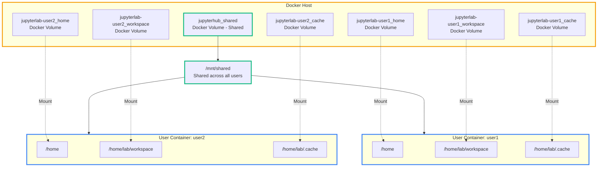

# Stellars JupyterHub for Data Science Platform


[](https://kolomolo.com)
[](https://www.paypal.com/donate/?hosted_button_id=B4KPBJDLLXTSA)

Multi-user JupyterHub 4 deployment platform with data science stack, GPU support, and NativeAuthenticator. The platform spawns isolated JupyterLab environments per user using DockerSpawner, backed by the [stellars/stellars-jupyterlab-ds](https://hub.docker.com/r/stellars/stellars-jupyterlab-ds) image (from [stellars-jupyterlab-ds](https://github.com/stellarshenson/stellars-jupyterlab-ds) project).

## Features

- **GPU Auto-Detection**: Automatic NVIDIA CUDA GPU detection and configuration for spawned user containers
- **Notification Broadcast**: Admin broadcast to all active servers via `/hub/notifications`. Supports six notification types, 140-character limit. Requires [jupyterlab_notifications_extension](https://github.com/stellarshenson/jupyterlab_notifications_extension)
- **User Self-Service**: Users can restart their JupyterLab containers and selectively reset persistent volumes (home/workspace/cache) without admin intervention
- **Docker Access Control**: Group-based access via `docker-sock` (container orchestration) and `docker-privileged` (full container privileges)
- **Isolated Environments**: Each user gets dedicated JupyterLab container with persistent volumes via DockerSpawner
- **Native Authentication**: Built-in user management with NativeAuthenticator supporting optional self-registration (`ENABLE_SIGNUP`) and admin approval. Authorization page protects existing users from accidental discard - only pending signup requests can be discarded
- **Admin User Creation**: Batch user creation from admin panel with auto-generated mnemonic passwords (e.g., `storm-apple-ocean`). Credentials modal with copy/download options
- **Shared Storage**: Optional CIFS/NAS mount support for shared datasets across all users
- **Production Ready**: Traefik reverse proxy with TLS termination, automatic container updates via Watchtower

## User Interface

**User Control Panel**

User control panel with server restart and volume management options.


**Volume Management**

Access volume management when server is stopped.


**Volume Selection**

Select individual volumes to reset - home directory, workspace files, or cache data.


**Admin Notification Broadcast**

Admin panel for broadcasting notifications to all active JupyterLab servers.


## Architecture


Users access JupyterHub through Traefik reverse proxy with TLS termination. After authentication via NativeAuthenticator, JupyterHub spawns isolated JupyterLab containers per user using DockerSpawner. Each user gets dedicated persistent volumes for home directory, workspace files, and cache data, with optional shared storage for collaborative datasets.

## Configuration Flow

```mermaid
graph TB
    subgraph ENV["Environment Variables (compose.yml)"]
        ADMIN[JUPYTERHUB_ADMIN<br/>Admin username]
        BASEURL[JUPYTERHUB_BASE_URL<br/>URL prefix]
        IMG[DOCKER_NOTEBOOK_IMAGE<br/>User container image]
        NET[DOCKER_NETWORK_NAME<br/>Container network]
        SSL[ENABLE_JUPYTERHUB_SSL<br/>0=off, 1=on]
        GPU[ENABLE_GPU_SUPPORT<br/>0=off, 1=on, 2=auto]
        SIGNUP[ENABLE_SIGNUP<br/>0=admin-only, 1=self-register]
        TFLOG[TF_CPP_MIN_LOG_LEVEL<br/>TensorFlow verbosity]
        NVIMG[NVIDIA_AUTODETECT_IMAGE<br/>CUDA test image]

        subgraph SVCEN["ENABLE_SERVICE_*<br/>Passed to Lab as env"]
            direction LR
            MLF[ENABLE_SERVICE_MLFLOW]
            GLN[ENABLE_SERVICE_GLANCES]
            TNS[ENABLE_SERVICE_TENSORBOARD]
            SVC_MORE[...]
        end
    end

    subgraph CONFIG["jupyterhub_config.py"]
        AUTH[NativeAuthenticator<br/>open_signup=False]
        SPAWN[DockerSpawner<br/>spawner_class, remove=True]
        NBDIR[DOCKER_NOTEBOOK_DIR<br/>/home/lab/workspace]
        VOLS[DOCKER_SPAWNER_VOLUMES<br/>home/workspace/cache/shared]
        VOLDESC[VOLUME_DESCRIPTIONS<br/>Optional UI labels]
        GROUPS[BUILTIN_GROUPS<br/>docker-sock, docker-privileged]
        HOOK[pre_spawn_hook<br/>Group check + privileges]
        HANDLERS[extra_handlers<br/>ManageVolumes, RestartServer, Notifications]
        TEMPLATES[template_paths<br/>Custom + Native + Default]
    end

    subgraph RUNTIME["Spawned User Container"]
        LAB[JupyterLab Server<br/>Port 8888]
        SERVICES[Services: MLflow, Glances, TensorBoard<br/>Controlled by ENABLE_SERVICE_* env]
        GPUACCESS[GPU Access<br/>device_requests if enabled]
    end

    ADMIN --> AUTH
    SIGNUP --> |enable_signup| AUTH
    BASEURL --> CONFIG
    IMG --> SPAWN
    NET --> SPAWN
    SSL --> CONFIG
    TFLOG --> |Passed as env| LAB
    NVIMG --> |Used for auto-detect| CONFIG

    GPU --> |Auto-detect via nvidia-smi| SPAWN
    GPU --> |Passed as env| LAB
    GPU --> |device_requests| GPUACCESS

    SVCEN --> |Passed as env| LAB
    SVCEN --> |Controls startup| SERVICES

    AUTH --> |Validates| SPAWN
    SPAWN --> |Creates| LAB
    NBDIR --> SPAWN
    VOLS --> |Mounts| LAB
    VOLDESC --> HANDLERS
    GROUPS --> HOOK
    HOOK --> |Conditionally mounts<br/>docker.sock| LAB
    HANDLERS --> |API endpoints| LAB
    TEMPLATES --> |Custom UI| LAB

    style ENV stroke:#f59e0b,stroke-width:3px
    style SVCEN stroke:#a855f7,stroke-width:2px
    style CONFIG stroke:#10b981,stroke-width:3px
    style RUNTIME stroke:#3b82f6,stroke-width:3px
    style HOOK stroke:#ef4444,stroke-width:2px
    style HANDLERS stroke:#ef4444,stroke-width:2px
```



Environment variables defined in `compose.yml` are consumed by `config/jupyterhub_config.py` to configure authentication, spawner behavior, and GPU detection. The configuration defines `DOCKER_SPAWNER_VOLUMES` for persistent storage, `VOLUME_DESCRIPTIONS` for optional UI labels, and `BUILTIN_GROUPS` for protected group management. When spawning user containers, these settings control which services are enabled (MLflow, Glances, TensorBoard), whether GPU access is granted via `device_requests`, and what volumes are mounted. The pre-spawn hook checks user group membership against `BUILTIN_GROUPS` to conditionally mount docker.sock for privileged users.

## GPU Auto-Detection


When `ENABLE_GPU_SUPPORT=2` (auto-detect mode), JupyterHub spawns a temporary CUDA container running `nvidia-smi` with `runtime=nvidia`. If the command succeeds, GPU support is enabled and `device_requests` are added to spawned user containers. If it fails, GPU support is disabled. The test container is always removed after detection. Manual override is possible by setting `ENABLE_GPU_SUPPORT=1` (force enable) or `ENABLE_GPU_SUPPORT=0` (force disable).

## User Self-Service Workflow


Users manage their servers through the home page. Running servers can be restarted via Docker API without recreation. Stopped servers can be started normally or have volumes selectively deleted through a modal interface presenting checkboxes for home, workspace, and cache volumes with optional descriptions from configuration.

## Volume Architecture



Each user receives four persistent volumes. Three user-specific volumes store home directory files, workspace projects, and cache data. The shared volume provides collaborative storage accessible across all user environments. Volume names follow the pattern `jupyterlab-{username}_<suffix>` for per-user isolation. The shared volume can be configured as CIFS mount for NAS integration.

Users can selectively reset their personal volumes (home, workspace, cache) at any time through the Manage Volumes feature when their server is stopped. The shared volume cannot be reset by individual users as it contains collaborative data accessible to all users.

## References

This project spawns user environments using docker image: [stellars/stellars-jupyterlab-ds](https://hub.docker.com/r/stellars/stellars-jupyterlab-ds)

Visit the project page for stellars-jupyterlab-ds: https://github.com/stellarshenson/stellars-jupyterlab-ds

## Requirements

**Docker Socket Access Required**: This JupyterHub implementation requires read-write access to the Docker socket (`/var/run/docker.sock`) mounted into the JupyterHub container. This is essential for:

- **DockerSpawner**: Spawning and managing isolated JupyterLab containers for each user
- **Volume Management**: Allowing users to reset their persistent volumes (home/workspace/cache)
- **Container Control**: Enabling server restart functionality from the user control panel
- **Docker Access**: Supporting docker.sock and privileged mode for trusted users within their JupyterLab environments

The `compose.yml` file includes this mount by default:
```yaml
volumes:
  - /var/run/docker.sock:/var/run/docker.sock:rw
```

> [!WARNING]
> The JupyterHub container has full access to the Docker daemon. Only trusted administrators should have access to JupyterHub configuration.

## Quickstart

### Docker Compose
1. Download `compose.yml` and `config/jupyterhub_config.py` config file
2. Run: `docker compose up --no-build`
3. Open https://localhost/jupyterhub in your browser 
4. Add `admin` user through self-sign-in (user will be authorised automatically)
5. Log in as `admin`

### Start Scripts
- `start.sh` or `start.bat` – standard startup for the environment
- `scripts/build.sh` alternatively `make build` – builds required Docker containers

### Authentication
This stack uses [NativeAuthenticator](https://github.com/jupyterhub/nativeauthenticator) for user management. Admins can whitelist users or allow self-registration. Passwords are stored securely.


## Deployment Notes

- Ensure `config/jupyterhub_config.py` is correctly set for your environment (e.g., TLS, admin list).
- Optional volume mounts and configuration can be modified in `jupyterhub_config.py` for shared storage.

## Customisation

You should customise the deployment by creating a `compose_override.yml` file.  

#### Custom configuration file
Example below introduces custom config file `jupyterhub_config_override.py` to use for your deployment:

```yaml
services:
  jupyterhub:
    volumes:
      - ./config/jupyterhub_config_override.py:/srv/jupyterhub/jupyterhub_config.py:ro # config file (read only)
```

#### Enable GPU

No changes required in the configuration if you allow NVidia autodetection to be performed.
Otherwise change the `ENABLE_GPU_SUPPORT = 1`

Changes in your `compose_override.yml`:
```yaml
services:
  jupyterhub:
    environment:
      - ENABLE_GPU_SUPPORT=1 # enable NVIDIA GPU, values: 0 - disabled, 1 - enabled, 2 - auto-detect
```

#### Disable self-registration

By default, users can self-register and require admin approval. To disable self-registration entirely (admin must create users via `/hub/admin`):

```yaml
services:
  jupyterhub:
    environment:
      - ENABLE_SIGNUP=0 # disable self-registration, admin creates users
```

#### Custom Logo

Replace the default JupyterHub logo with a custom logo via environment variable. Supports URLs, file:/// paths, or data URIs:

```yaml
services:
  jupyterhub:
    environment:
      - JUPYTERHUB_CUSTOM_LOGO_URI=https://example.com/logo.png
      # Or data URI: data:image/png;base64,iVBORw0KGgo...
      # Or file path: file:///mnt/shared/logo.png
```

Leave empty (default) to use the stock JupyterHub logo.

#### Enable shared CIFS mount

Changes in your `compose_override.yml`:
```yaml
  jupyterhub:
    volumes:
      - ./config/jupyterhub_config_override.py:/srv/jupyterhub/jupyterhub_config.py:ro # config file (read only)
      - jupyterhub_shared_nas:/mnt/shared # cifs share
    
volumes:
  # remote drive for large datasets
  jupyterhub_shared_nas:
    driver: local
    name: jupyterhub_shared_nas
    driver_opts:
      type: cifs
      device: //nas_ip_or_dns_name/data
      o: username=xxxx,password=yyyy,uid=1000,gid=1000
```

in the config file you will refer to this volume by its name `jupyterhub_shared_nas`:

```python
# User mounts in the spawned container
c.DockerSpawner.volumes = {
    "jupyterlab-{username}_home": "/home",
    "jupyterlab-{username}_workspace": DOCKER_NOTEBOOK_DIR,
    "jupyterlab-{username}_cache": "/home/lab/.cache",
    "jupyterhub_shared_nas": "/mnt/shared"
}
```

#### Docker Access Control Groups

> [!WARNING]
> Both groups grant significant privileges. `docker-sock` provides Docker host control. `docker-privileged` provides full container privileges. Only grant to trusted users.

Two built-in groups control Docker access levels:

- **`docker-sock`**: Mounts `/var/run/docker.sock` into the user container. Enables Docker CLI, container orchestration, image builds, and Docker Compose operations
- **`docker-privileged`**: Runs user container with `--privileged` flag. Enables hardware access, loading kernel modules, nested virtualization, and operations requiring elevated capabilities

**How to Grant Access**:

1. Admin Panel → Groups (`/hub/admin`)
2. Click on `docker-sock` or `docker-privileged` group
3. Add users to the group
4. Users restart their server for changes to take effect

**Technical Details**:

Both groups are built-in protected groups (auto-recreated if deleted). Pre-spawn hook (`config/jupyterhub_config.py::pre_spawn_hook`) checks membership before spawning containers.

<!-- EOF -->
