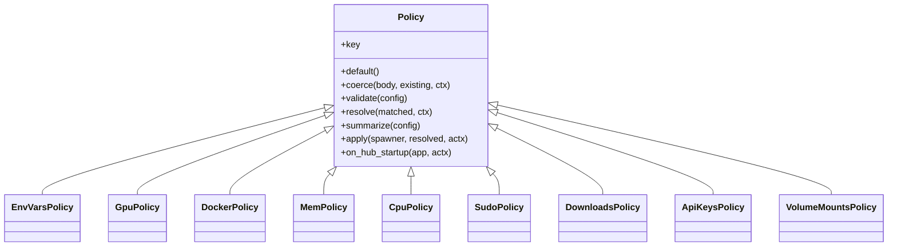
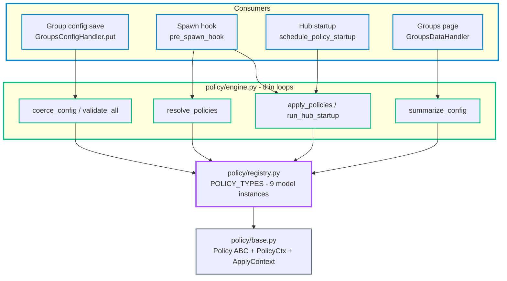
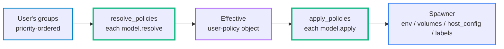

# Group Policy Model - Design

Group permissions are defined once each, as policy-type models. A group's config is a set of typed policies; at spawn a user's groups collapse into one effective policy object, and each model imposes its own slice on the spawning server. One registry is the single source for every permission's default, write-rule, combine-rule, display, and imposition.

## Why

- **One definition per permission** - a new permission is one model class, not edits across a resolver, a validator, a save handler, a 340-line spawn hook, and three startup callbacks
- **Inspectable combine rules** - OR-grant, biggest-wins, priority-wins, list-union each live in one model's `resolve`, named and unit-tested in isolation
- **Symmetric** - resolution and application are both thin registry loops; no monolithic apply branch that drifts from the registry
- **No display drift** - the admin UI badges and tooltip render server-computed summaries; the browser holds no policy logic

## The model

Every permission is a `Policy` subclass owning its whole lifecycle. `POLICY_TYPES` is the ordered list of model instances the engine loops over.

- **`default()`** - the off-state slice this type contributes to `default_config()`
- **`coerce(body, existing, ctx)`** - normalise and reject an admin write (may raise `PolicyCoerceError`)
- **`validate(config)`** - coherence check, `(ok, message)`; the engine tags failures with `validate_code`
- **`resolve(matched, ctx)`** - collapse this type's value across the user's groups; owns the combine strategy
- **`summarize(config)`** - display facet, `{badge, detail}` or `None`
- **`apply(spawner, resolved, actx)`** - impose the resolved value on a spawning server (the controller)
- **`on_hub_startup(app, actx)`** - re-impose / reconcile for servers that survived a hub restart

## Architecture

Three layers: the `Policy` interface, the registry of model instances, and a thin engine the consumers call. The registry imports only the model base and `api_keys_pool` (stdlib at import); heavy imports live inside `apply`/`on_hub_startup`.

## Resolution

A user belongs to several groups, ordered by priority descending. `resolve_policies` walks the matched groups once, hands each model its per-group values, and assembles one effective user-policy object - the same key set the spawn hook reads.

Combine strategy is declared per model, behaviour unchanged from the legacy resolver:

| Policy | Combine rule |
|--------|--------------|
| env_vars | priority-first-wins on name; reserved names stripped |
| gpu | OR-grant; all-GPUs wins else device-id union; hardware-gated |
| docker | OR-grant access/limited/privileged; max quota; raw supersedes limited |
| mem | biggest-enabled-GB wins; swap policy follows the winning cap |
| cpu | biggest-enabled-cores wins |
| sudo / downloads | section-gated, highest-priority configuring group wins; `None` -> platform default |
| api_keys | priority-ordered pool list |
| volume_mounts | union keyed by mountpoint; priority-wins on conflict |

## Application

`apply_policies` loops the models in registry order so the api-keys pool sees group env vars already set. `ApplyContext` carries the spawn-time hub config (docker-proxy dirs, compose project, GPU uuid map, sudo/downloads defaults, reconcile interval), built once in `make_pre_spawn_hook`.

- **env_vars** - `spawner.environment.update`
- **gpu** - `device_requests` + `NVIDIA_VISIBLE_DEVICES` / `CUDA_VISIBLE_DEVICES` + `ENABLE_GPU*`
- **docker** - raw-socket mount / proxy `register_user` + subpath mount + `DOCKER_HOST` / neither; privileged flag
- **mem** - `spawner.mem_limit` bytes + `memswap_limit`
- **cpu** - `spawner.cpu_limit`, ceil to whole cores
- **sudo** - `JUPYTERLAB_SUDO_ENABLE` from the resolved value or the platform default
- **volume_mounts** - `spawner.volumes` add, with unmount-on-leave tracking
- **api_keys** - `PoolManager.assign` + durable slot label + env precedence vs group env vars
- **downloads** - per-user CHP block routes + guard handlers, or unregister

## Restart lifecycle

A spawned lab outlives the hub, so `pre_spawn_hook` does not fire for survivors. `schedule_policy_startup` runs each model's `on_hub_startup` once at boot.

- **api_keys** - rebuild the in-use slot set from durable container labels, then start the periodic reconcile; a survivor keeps its slot and a new spawn never collides
- **docker** - re-bind the in-process proxy listener for limited-docker survivors
- **downloads** - re-register block routes for surviving blocked users

## Save and display

- **Save** - `GroupsConfigHandler.put` loops `coerce_config` then `validate_all`; a structured `PolicyCoerceError` renders the reserved-name JSON, a plain one a bare 400
- **Display** - `GroupsDataHandler` attaches `summarize_config` output as `policy_summary` (`[{key, badge, detail}]`); the group table badges and hover tooltip render it directly
- **Bundle** - a group serialises to `{group_name, description, priority, policies}` - the unit import/export builds on

## Adding a policy type

- Write one `Policy` subclass (default + the facets it needs) and add an instance to `POLICY_TYPES`
- Defaults, save validation, resolution, the spawn application, the badge and tooltip all pick it up through the existing loops - no consumer edits

## Boundaries

- **Not policies** - favicon CHP routes, docker-compose project labels, and JupyterLab icon URIs are hub-identity concerns, not group-scoped; they stay inline in `pre_spawn_hook`
- **Best-effort downloads** - the download block is a hub-side policy + notification + audit control, not exfiltration prevention (the lab has root, sudo, and egress)
- **Per-type combine rules** - the model unifies structure, not semantics; "biggest mem wins" and "union of mounts" are not one allow/deny law
