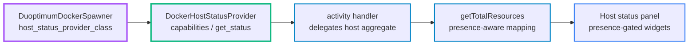

# Host Status Provider - Design

The home-screen host-status view is bound to one environment - a local Docker host with `/proc`, the Docker socket, and an NVIDIA gpuinfo sidecar. To package other environments (HPC/cluster, Kubernetes, remote host, WSL2) into DuOptimum Hub, the view is decoupled behind a `HostStatusProvider` associated with the spawner. The provider probes its own environment for a fixed, minimal resource set - compute (CPU), memory, GPU - and reports each one's value and status, or nothing. The portal renders whatever comes back, including an empty result.

## Why

- **Per-environment view** - each spawner knows its own resources; a Docker host reports `/proc` + container stats + GPU, a cluster reports its allocation, a dumb spawner reports nothing
- **Packageable** - a new environment ships as a Duoptimum spawner subclass + its provider, zero portal rebuild; the contract is data, not React
- **Minimal contract** - the schema is fixed at `{cpu, mem, gpu}`, each optional; extend only when a real environment needs more, never speculatively
- **Graceful absence** - a provider that exposes a subset renders just that subset; one that exposes nothing renders no panel, nothing lost

## The contract

Backend ABC. The hub holds one provider instance, resolved from the configured spawner at boot.

- **`capabilities()`** - the dimensions this environment exposes, any subset of `{CPU, MEM, GPU}`
- **`get_status()`** - current values for the exposed dimensions, each tagged `ok | degraded | unavailable`; dimensions not in `capabilities()` are absent

Fixed schema, each top key optional:

```
HostStatus
  cpu  { used_pct, host_total_cores, status }
  mem  { used_pct, host_total_mb,    status }
  gpu  { devices[], connected,       status }
```

- **present + ok** - real values
- **present + degraded/unavailable** - the dimension exists but is unreadable right now (sidecar down -> gpu unavailable); the portal shows it in its error state
- **absent** - the environment has no such dimension; the portal omits it



## Association

The provider is declared on the spawner subclass - one integration is one Duoptimum spawner plus its provider.

- **`DuoptimumDockerSpawner`** (renamed from `TimingDockerSpawner`, timing instrumentation kept) declares `host_status_provider_class = DockerHostStatusProvider`
- At boot the hub reads `c.JupyterHub.spawner_class`, instantiates its provider once (configured with the resolved gpuinfo URL), and stores it in `stellars_config`
- A future `DuoptimumKubeSpawner` declares `KubeHostStatusProvider`; the hub wiring does not change
- A spawner that declares no provider yields no host-status panel, by construction

## The reference provider

`DockerHostStatusProvider` owns the logic that today sits inline in `handlers/activity.py`, moved not rewritten.

- **CPU** - host cores from `/proc/cpuinfo`, used% aggregated from `container_stats_cache`
- **MEM** - host total from `/proc/meminfo`, used% aggregated
- **GPU** - inventory from `stellars_config['gpu_list']`, live sample from `gpu_cache`, `connected` from `gpu_sidecar_connected()`; absent from `capabilities()` when no gpuinfo network is configured
- `get_status()` returns all exposed dimensions; each degrades independently (proc unreadable -> cpu/mem unavailable; sidecar down -> gpu unavailable)

The activity handler delegates the host-aggregate portion to `provider.get_status()` and keeps the per-user server rows (JupyterHub DB + per-user stats) untouched - those are a separate surface.

## Frontend

The host-status panel becomes presence-driven; no generic panel engine, just the three known widgets gated on their dimension.

- **Snapshot** - `ResourceSnapshot` carries per-dimension presence + status alongside the existing values
- **Adapter** - `getTotalResources` maps the provider output, marking each dimension present / absent / degraded
- **Render** - `ResourceBars` composes independent CPU, memory and GPU widgets, each rendered only when present; a degraded dimension shows its error state; all three present -> today's view unchanged; none present -> the panel is hidden

## Build order

1. **Backend seam** - new `host_status` module: the ABC + `HostStatus` schema; `DockerHostStatusProvider` with the `/proc` + stats + GPU logic moved from `handlers/activity.py`; unit tests (capabilities, full status, each-dimension-degraded, null provider)
2. **Spawner** - rename `timing_spawner.TimingDockerSpawner` -> `DuoptimumDockerSpawner`, declare `host_status_provider_class`; update `c.JupyterHub.spawner_class`, package exports, config reference; boot resolves the provider into `stellars_config`
3. **Handler** - `activity.py` delegates the host aggregate to `provider.get_status()`, keeps per-user rows; response carries per-dimension status
4. **Frontend** - extend `ResourceSnapshot` + `getTotalResources`; split `ResourceBars` into presence-gated widgets; hide the panel when empty
5. **Verify** - unit + frontend tests; adversarial review (architect: seam / separation / drift; ux: subset + empty render); rebuild + redeploy + live-verify the admin view unchanged; functional regime green

## Scope

- **In** - the provider seam, `DockerHostStatusProvider` (logic moved), the spawner rename, the presence-driven panel; the live admin view is unchanged
- **Out** - HPC / Kubernetes / remote providers (future packages against this contract); a per-server host view (contract shaped to allow it later); de-NVIDIA-ifying the GPU device-request plumbing (`'Driver':'nvidia'`, `NVIDIA_*` env, `runtime='nvidia'`) - separate follow-up

## Boundaries

- **Host aggregate only** - the provider owns the host-level resource view; per-user server rows stay in the activity handler
- **Data, not widgets** - a provider returns the fixed schema; it never ships UI, so onboarding an environment needs no portal rebuild
- **Fixed schema** - `{cpu, mem, gpu}` is the whole contract until a real environment forces an extension
