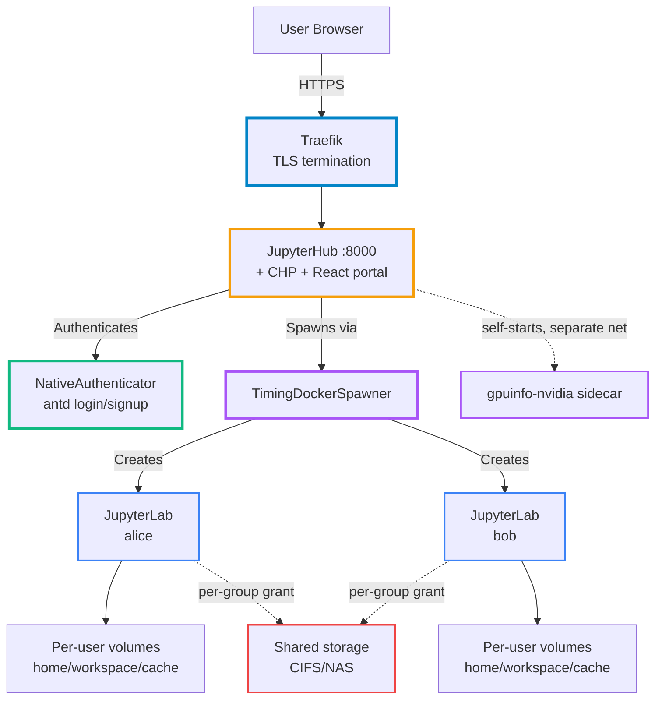
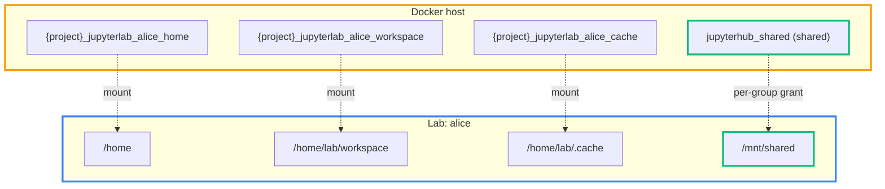

# Duoptimum Hub - Platform Architecture

Technical reference for how the platform is wired. Docker Compose runs three long-lived services; the hub spawns an isolated JupyterLab container per user and serves a React portal that replaces the stock JupyterHub UI. For an approachable overview and quickstart, see the [README](../README.md).

## Services

Three declared Compose services plus one the hub self-starts.

- **traefik** (`traefik:latest`) - reverse proxy, TLS termination, the single L7 ingress for hub and labs; ports 80, 443, 8080; watches `jupyterhub_certs` for hot-reload
- **duoptimumhub** (`stellars/duoptimumhub:latest`, built from `Dockerfile.jupyterhub`) - the hub: authentication, DockerSpawner, in-process docker-proxy, portal, background services; internal port 8000
- **watchtower** (`nickfedor/watchtower:latest`) - monitor-only image refresh, daily at midnight UTC
- **gpuinfo-nvidia** - NOT a Compose service; the hub self-starts it via `ensure_gpuinfo_sidecar()` and tears it down on shutdown; GPU detection + live utilisation sampling

## Networks and volumes

- **jupyterhub_network** - hub, Traefik, and all spawned user containers
- **jupyterhub_gpuinfo** - created at runtime by the hub; hub-to-sidecar only, user labs cannot reach the sidecar
- **jupyterhub_data** - user accounts, config, cookie secret, and the SQLite databases
- **jupyterhub_certs** - TLS certs (auto-generated or provisioned), read by Traefik
- **jupyterhub_shared** - collaborative storage, mounted per-group at `/mnt/shared` (no longer auto-mounted into every lab)
- **jupyterhub_docker** - the in-process docker-proxy's per-user listener sockets, subpath-mounted into each limited-Docker lab

Three SQLite databases live under `/data`: `jupyterhub.sqlite` (core), `activity_samples.sqlite` (activity), `groups_config.sqlite` (group policy).

## Resource identification by role label

Any floating named Docker resource the hub references in code outside its own compose-declared mounts is identified by a stable role label, never by a name. A name is local to a deployment and can be renamed at any time; the moment the code reconstructs or hardcodes one, it silently resolves to the wrong resource or 404s (the `jupyterhub_shared` to `hub_shared` rename did exactly this). The label is the contract; the name is free to change.

The hub stamps and discovers three label namespaces, all under the `duoptimum-hub.` prefix: `duoptimum-hub.volume.role` (values `shared`, `docker-proxy`, and per-user `lab-home` / `lab-workspace` / `lab-cache`), `duoptimum-hub.network.role` (`lab`, `gpuinfo`), and `duoptimum-hub.container.role` (`gpuinfo`). Per-user volumes additionally carry `duoptimum-hub.volume.owner` (the username) and `duoptimum-hub.volume.description`, so a volume self-describes - the portal reads role, owner and description straight off the labels rather than from a separate file. Compose stamps the literals on its declared resources; the hub bakes the matching keys and values as image defaults, and a build test asserts the two agree. The docker-proxy tags user-created resources with `duoptimum-hub.docker.proxy.owner` (the username) under the same `duoptimum-hub.` top namespace, unified via the `JUPYTERHUB_LABEL_DOCKER_PROXY_OWNER_*` envs ({username} substituted at stamp time); these mark user resources, distinct from hub-owned ones.

Discovery is scoped to the hub's own attachments: the hub inspects only the volumes it mounts and the networks it is attached to, reads their labels, and matches by role. Resolution is exact - one source, no name reconstruction and no fallback chain. A resource that resolves to more than one match for a single role is a fatal inconsistency and the resolver raises rather than guess; the only tolerated absence is a per-user lab volume that predates labelling, which falls back to its name suffix.

## Namespace

The deployment namespace is the Docker Compose project, discovered at boot from the hub's own `com.docker.compose.project` label (`resolve_self_compose_project`) - never passed as an env, so it cannot drift from the real volume prefix. It is named "namespace" deliberately as an abstraction: a future Kubernetes deployment maps it to a k8s namespace without changing the model. Uniqueness of a role is checked within the namespace, not across the host, so many deployments run side by side on one Docker host - each owns its own role-labelled `hub_shared`, `hub_docker` and networks, and one deployment's resources never trip another's uniqueness check. Because the resolvers only ever look at the hub's own mounts and attachments, this scoping holds by construction.

## Configuration validation

The hub gathers its configuration from environment variables (required values baked into the image, not defaulted in the config file) and hands the lot to a single validator (`duoptimum_hub_services.config_validator.validate_hub_config`) before it starts serving. The validator returns errors and warnings. An error - a missing required value, or an inconsistency such as the lab and gpuinfo networks sharing a role, or a per-user template missing its `{username}` placeholder - aborts the boot with one aggregated message naming every offender, so a misconfiguration surfaces in a single pass rather than one failed boot at a time. A warning - an unresolved gpuinfo network (GPU features off), an unresolved shared volume (the one-click mount hidden), or a branding `file://` icon whose file is missing - is logged and the hub starts degraded. Keeping the logic in one validator keeps the config file thin and the rules unit-tested.

## Topology



## Request routing

The platform ingresses through one Traefik router; the hub's Configurable HTTP Proxy (CHP) fans out to labs.

- **Traefik router** - matches the hostname/path set for the deployment and forwards to `duoptimumhub:8000`; TLS terminates at Traefik, the backend hop is HTTP
- **Aliases** - `/jupyterhub`, `/hub`, `/optimumhub`, `/duoptimumhub` all reach the hub; in the standalone PATH deployment a `hub-alias-redirect` middleware 302s the three aliases to canonical `/jupyterhub`
- **base_url** - `JUPYTERHUB_BASE_URL` (default `/jupyterhub`); all hub routes are prefixed with it
- **Hub to labs** - spawned labs register with CHP at `hub_connect_url` (`http://duoptimumhub:8080`) and tunnel their Jupyter API/WebSocket traffic back through the hub
- **Rate limiting** - per-source-IP at the Traefik router (`JUPYTERHUB_RATELIMIT_*`), WebSocket-safe

## The portal

The admin/user UI is a React SPA served by the `duoptimum_hub_web` package, not stock JupyterHub templates.

- **Landing** - `c.JupyterHub.default_url` points at `/hub/dashboard`; `PortalHandler` renders the SPA shell
- **Catch-all** - the portal handler serves SPA routes via a negative-lookahead route that does not shadow `/logo` or `/api/`
- **Stock UI replaced** - `/home`, `/admin`, `/login`, `/signup` render antd-styled pages
- **Bootstrap data** - `window.jhdata` carries the xsrf token, base_url, and admin flag, injected at render
- **No server-rendered admin pages** - notifications, settings, activity, and groups are client-side SPA routes backed by JSON APIs

## Hub configuration

`config/jupyterhub_config.py` reads env vars, builds data literals, runs setup logic, then applies JupyterHub config.

- **Authenticator** - `BootstrapAdminAuthenticator`, a subclass of `DuoptimumHubAuthenticator` (NativeAuthenticator + antd login/signup); `open_signup=False`
- **Admin bootstrap** - two modes: signup-window (first admin self-signs-up on an empty DB) or env-seeded (`JUPYTERHUB_ADMIN_PASSWORD`, initial-only, bcrypt-verified); admin role granted at login by `post_auth_hook`
- **Spawner** - `duoptimum_hub_services.timing_spawner.TimingDockerSpawner` (DockerSpawner with timing logs); `name_template=jupyterlab-{username}`, `remove=True`, per-user `volumes`
- **pre_spawn_hook** - resolves the user's groups into an effective policy and applies it (Docker access, GPU, env, CPU/mem, sudo, downloads, volume mounts, API-key slot), registers the user with the docker-proxy, and adds CHP favicon + compose-project labels
- **post_stop_hook** - unregisters the docker-proxy user and releases the API-key slot
- **Managed service** - an always-on activity sampler (background process) records per-user activity
- **Idle culler** - runs in-process when enabled, so per-user session extensions actually delay the cull
- **Startup hydration** - deferred after the hub is serving: warms caches, re-imposes policy on surviving servers, checks image updates

## API handlers

Custom handlers live in `duoptimum_hub_services/handlers/` under `/hub/api/`; the portal handlers (`duoptimum_hub_web`) serve the SPA.

| Route | Method | Purpose |
|-------|--------|---------|
| `/api/activity` | GET | Per-user activity + Docker stats (admin) |
| `/api/activity/reset` | POST | Clear activity samples (admin) |
| `/api/notifications/broadcast` | POST | Broadcast to active servers (admin) |
| `/api/notifications/active-servers` | GET | List running servers (admin) |
| `/api/users/{user}/manage-volumes` | GET/DELETE | List/reset user volumes |
| `/api/users/{user}/restart-server` | POST | Docker container restart |
| `/api/users/{user}/server/logs` | GET | Bounded container log tail |
| `/api/users/{user}/session-info` | GET | Idle-culler status + extension |
| `/api/users/{user}/extend-session` | POST | Add culler hours (capped) |
| `/api/users/{user}/profile` | GET/PUT | First/last name + email |
| `/api/users/{user}/rename` | POST | Admin rename |
| `/api/users/{user}/force-password-change` | POST | Admin set/clear force-pw gate |
| `/api/users/{user}/effective-grants` | GET | Resolved group policy for a user |
| `/api/admin/groups` `…/create` `…/{name}/config` `…/{name}/delete` `…/reorder` | GET/POST/PUT/DELETE | Group CRUD + per-group config + priority |
| `/api/native-users` `…/{name}/authorization` | GET/POST | NativeAuth signups + auth state |
| `/api/admin/credentials` | GET | Cached auto-generated passwords (admin) |
| `/api/settings` | GET | Platform settings as JSON |
| `/api/events` | GET | Recent platform events (audit feed) |
| `/health` | GET | Unauthenticated monitoring endpoint |

## Access control and groups

Group policy is the single source of truth for what the pre-spawn hook applies. There are no hardcoded built-in groups.

- **Storage** - group config persists in `/data/groups_config.sqlite`, managed by `GroupsConfigManager`; the stock JupyterHub admin panel still manages membership and its groups are auto-discovered
- **Admin page** - `/hub/groups` creates, deletes, prioritises, and configures groups
- **Resolution** - the hook fetches the user's groups, loads all configs, collapses them into one effective policy (`resolve_policies`), and applies each policy model
- **Three Docker modes** - **Standard** (raw `/var/run/docker.sock`, full host control), **Limited** (per-user filtered socket via the in-process proxy with quotas + owner labelling), **Privileged** (orthogonal `--privileged` lab); a group with no Docker section grants no Docker access
- **Docker proxy** - `duoptimum_docker_proxy` runs in-process (`Manager` singleton); each limited user gets a listener socket under the `jupyterhub_docker` volume, mounted into their lab; registered in `pre_spawn_hook`, removed in `post_stop_hook`
- See [docs/limited-docker-access.md](limited-docker-access.md) for proxy internals and the full env contract

## GPU

Two separate concerns: detecting GPUs at boot, and sampling live utilisation. Both go through the self-started sidecar, not a throwaway test container.

- **Sidecar** - the hub self-starts `gpuinfo-nvidia` (image `JUPYTERHUB_GPUINFO_NVIDIA_IMAGE`) on the `jupyterhub_gpuinfo` network with `runtime=nvidia`; reachable at `JUPYTERHUB_GPUINFO_URL` (default `http://gpuinfo-nvidia:8000`); exposes `/gpu/devices` (inventory) and `/gpu/stats` (live load, memory, temp, power, processes)
- **Detection** - `resolve_gpu_mode(JUPYTERHUB_GPU_ENABLED, ...)` probes the sidecar for host inventory; on success sets `nvidia_detected=1` and caches the inventory, on failure falls back to the last-known cached inventory; mode `2` collapses to on/off from detection, `1` forces on, `0` off
- **Per-user** - `GpuPolicy` sets `device_requests` / `CUDA_VISIBLE_DEVICES` from group config at spawn; effective only when hardware is detected
- **Live meter** - `GpuUtilizationRefresher` polls `/gpu/stats` in the background and the activity endpoint merges it by device index
- **WSL2** - per-GPU container isolation is advisory only; native Linux required for true isolation
- See [docs/gpu-detection-and-configuration.md](gpu-detection-and-configuration.md) and [docs/gpuinfo-api.md](gpuinfo-api.md)

## Activity and resource monitoring

The admin dashboard reads warm snapshots, never a synchronous Docker gather on the request path.

- **Sampler** - `activity/service.py`, an always-on managed service, records every user (including offline) into `/data/activity_samples.sqlite` every `JUPYTERHUB_ACTIVITYMON_SAMPLE_INTERVAL` (default 600s); offline users keep being sampled so their score decays
- **Score** - decay-weighted fraction of active samples, `weight = exp(-ln2 * age / half_life)`; normalised against `JUPYTERHUB_ACTIVITYMON_TARGET_HOURS`
- **Container stats cache** - `container_stats_cache.py`, refreshed every `JUPYTERHUB_ACTIVITYMON_STATS_INTERVAL` (default 10s) for recently-active users only; zero Docker calls when all idle
- **Container size cache** - `container_size_cache.py`, every `JUPYTERHUB_ACTIVITYMON_CONTAINER_SIZE_INTERVAL` (default 300s)
- **Volume size cache** - `volume_cache.py`, every `JUPYTERHUB_ACTIVITYMON_VOLUMES_UPDATE_INTERVAL` (default 3600s)
- **CPU/memory bars** - per-server bars read against the server's assigned ceiling (CPU limit / memory limit), the host bars against host cores / host RAM; see [docs/acc-crit-resource-bars.md](acc-crit-resource-bars.md)
- See [docs/activity-tracking-methodology.md](activity-tracking-methodology.md)

## User self-service

Users manage their own server from the portal.

- **Restart** - running servers restart via the Docker API (`container.restart`) without recreation, preserving volumes
- **Volumes** - stopped servers can selectively reset home / workspace / cache volumes through a checkbox modal; the shared volume cannot be reset by users
- **Sessions** - when the idle culler is on, a status card shows time remaining and an extend control (whole hours, capped at the configured ceiling)
- **Admin parity** - admins can reset volumes and restart for any user
- See [docs/user-volumes.md](user-volumes.md)

## Volumes



- **Per-user** - three volumes (home, workspace, cache), named `{COMPOSE_PROJECT_NAME}_jupyterlab_{username}_<suffix>` so distinct deployments never collide
- **Templates** - loaded from the image-baked `volumes_dictionary.yml` plus an optional operator overlay
- **Shared** - granted per group via the Volume Mounts policy, not platform-wide; any admin-created volume can be mounted, protected system paths blocked

## Docker socket requirement

The hub mounts the host Docker socket read-write - it is the spawner, volume manager, and restarter.

```yaml
volumes:
  - /var/run/docker.sock:/var/run/docker.sock:rw
```

> [!WARNING]
> The JupyterHub container has full access to the Docker daemon. Only trusted administrators should have access to JupyterHub configuration.

## Configuration reference

Most knobs are env vars on the `duoptimumhub` service in `compose.yml`; deployment-specific values go in a `compose_override.yml` next to it.

### Configuration overlay

The bind-mount `./config/:/mnt/user_config:ro` is the operator overlay. A root `jupyterhub_config.py` there (plus any sibling `.py`, importable via `PYTHONPATH=/srv/config`) overrides the built-in config; empty or syntactically broken fails boot loudly (`exit 1`). Override the volume to point elsewhere, or `JUPYTERHUB_USER_CONFIG_FILE` to rename the root file. See [docs/configuration.md](configuration.md).

### GPU

```yaml
services:
  duoptimumhub:
    environment:
      - JUPYTERHUB_GPU_ENABLED=1 # 0=disabled, 1=enabled, 2=auto-detect
```

### Self-registration

```yaml
services:
  duoptimumhub:
    environment:
      - JUPYTERHUB_SIGNUP_ENABLED=0 # admin creates users via /hub/admin
```

The bootstrap window temporarily re-opens signup (admin name only) on a fresh empty DB, then the operator setting is honoured again.

### Idle culler

In-process so per-user extensions delay the cull; the ceiling is `timeout + max_extension`. Disabled by default.

```yaml
services:
  duoptimumhub:
    environment:
      - JUPYTERHUB_IDLE_CULLER_ENABLED=1
      - JUPYTERHUB_IDLE_CULLER_TIMEOUT_MINUTES=1440    # 24h - idle minutes before stop
      - JUPYTERHUB_IDLE_CULLER_INTERVAL=600            # check interval, seconds
      - JUPYTERHUB_IDLE_CULLER_MAX_AGE=0               # max age regardless of activity (0=unlimited)
      - JUPYTERHUB_IDLE_CULLER_MAX_EXTENSION_MINUTES=1440
```

### Abuse protection

One Traefik router covers hub and labs. Two layers: ingress rate limiting (WebSocket-safe) and hub-side spawn/login limits. Defaults are generous; `JUPYTERHUB_RATELIMIT_AVERAGE=0` disables the limiter.

```yaml
services:
  duoptimumhub:
    environment:
      - JUPYTERHUB_RATELIMIT_AVERAGE=100        # requests/period/IP (0=disable)
      - JUPYTERHUB_RATELIMIT_BURST=200
      - JUPYTERHUB_RATELIMIT_PERIOD=1s
      - JUPYTERHUB_RATELIMIT_XFF_DEPTH=1        # X-Forwarded-For depth (0 for direct exposure)
      - JUPYTERHUB_CONCURRENT_SPAWN_LIMIT=100
      - JUPYTERHUB_ACTIVE_SERVER_LIMIT=0        # 0=unlimited
      - JUPYTERHUB_LOGIN_MAX_FAILED_ATTEMPTS=5  # 0=disable
      - JUPYTERHUB_LOGIN_LOCKOUT_SECONDS=600
```

Behind an external proxy, `XFF_DEPTH=1` keys on the real client IP; direct-exposure deployments set `0`. L7 only - volumetric L3/L4 DDoS must be absorbed upstream. Traefik `inFlightReq` (slowloris cap) is intentionally off because JupyterLab holds many long-lived connections.

### Activity monitor

```yaml
services:
  duoptimumhub:
    environment:
      - JUPYTERHUB_ACTIVITYMON_SAMPLE_INTERVAL=600          # sample recording interval
      - JUPYTERHUB_ACTIVITYMON_RETENTION_DAYS=7
      - JUPYTERHUB_ACTIVITYMON_HALF_LIFE=72                 # decay half-life, hours
      - JUPYTERHUB_ACTIVITYMON_INACTIVE_AFTER=60            # inactive threshold, minutes
      - JUPYTERHUB_ACTIVITYMON_STATS_INTERVAL=10            # live cpu/mem refresh, active users
      - JUPYTERHUB_ACTIVITYMON_VOLUMES_UPDATE_INTERVAL=3600
      - JUPYTERHUB_LAB_CONTAINER_MAX_EXTRA_SPACE_GB=10      # writable-layer quota before warning (0=off)
      - JUPYTERHUB_LAB_VOLUME_MAX_TOTAL_SIZE_GB=50          # total volume quota before warning (0=off)
      - JUPYTERHUB_LAB_MEMORY_MAX_USAGE_FRACTION=0.25       # memory quota as fraction of host RAM
```

### Custom branding

`file://` URIs (mount the asset) or external URLs; empty keeps stock assets.

| Variable | Purpose |
|----------|---------|
| `JUPYTERHUB_BRANDING_STAGE` | Stage badge (DEV/STG/TST/PRD or custom); empty = none |
| `JUPYTERHUB_BRANDING_LOGO_URI` | Hub login and navigation logo |
| `JUPYTERHUB_BRANDING_FAVICON_URI` | Favicon for hub and JupyterLab sessions |
| `JUPYTERHUB_BRANDING_FAVICON_BUSY_URI` | Kernel-busy favicon frames; empty = JupyterLab default |
| `JUPYTERHUB_BRANDING_LAB_MAIN_ICON_URI` | JupyterLab main toolbar logo |
| `JUPYTERHUB_BRANDING_LAB_SPLASH_ICON_URI` | JupyterLab splash icon |

Three more variables forward into every lab so the user environment rebrands itself: `JUPYTERLAB_SYSTEM_NAME`, `JUPYTERLAB_HEADER_CAPITALIZE_SYSTEM_NAME`, `JUPYTERLAB_HEADER_SYSTEM_NAME_COLOR`. See [docs/custom-branding.md](custom-branding.md).

### Compose project grouping

`COMPOSE_PROJECT_NAME` (default `jupyterhub`) labels the hub and prefixes per-user volume names, so `docker compose ls` shows hub + all user containers as one project. Spawned containers stay named `jupyterlab-<username>`; volumes become `<project>_jupyterlab_<username>_{home,workspace,cache}`. Changing it after users have spawned orphans their old-named volumes - migrate with `docker run --rm -v <old>:/from -v <new>:/to alpine cp -a /from/. /to/` first.

### Admin startup scripts

```yaml
services:
  duoptimumhub:
    environment:
      - JUPYTERLAB_AUX_SCRIPTS_PATH=/mnt/shared/start-platform.d
```

Scripts on the shared volume run sequentially in every lab at launch, before JupyterLab starts - add/modify without rebuilding images.

### Shared CIFS mount

The shared volume is granted per group (Volume Mounts), not auto-mounted. Define a CIFS-backed volume and grant it:

```yaml
  duoptimumhub:
    volumes:
      - jupyterhub_shared_nas:/mnt/shared

volumes:
  jupyterhub_shared_nas:
    driver: local
    name: jupyterhub_shared_nas
    driver_opts:
      type: cifs
      device: //nas_ip_or_dns_name/data
      o: username=xxxx,password=yyyy,uid=1000,gid=1000
```

Then add it by name in a group's Volume Mounts (`jupyterhub_shared_nas` -> `/mnt/shared`); members get it on next spawn.

## Related documentation

- [Configuration overlay](configuration.md) - the operator config-file scenario matrix
- [Certificates](certificates.md) - TLS provisioning and the `/certs` + `/user-certs` overlay
- [GPU detection and configuration](gpu-detection-and-configuration.md)
- [GPU-info sidecar API](gpuinfo-api.md)
- [Limited Docker access](limited-docker-access.md)
- [Working with Docker in JupyterHub](jupyterhub-working-with-docker.md)
- [Activity tracking methodology](activity-tracking-methodology.md)
- [Resource bars acceptance criteria](acc-crit-resource-bars.md)
- [Custom branding](custom-branding.md)
- [User volumes](user-volumes.md)
- [duoptimum-hub-services package](duoptimum-hub-package.md)
- [Functional test system](functional-test-system.md)
