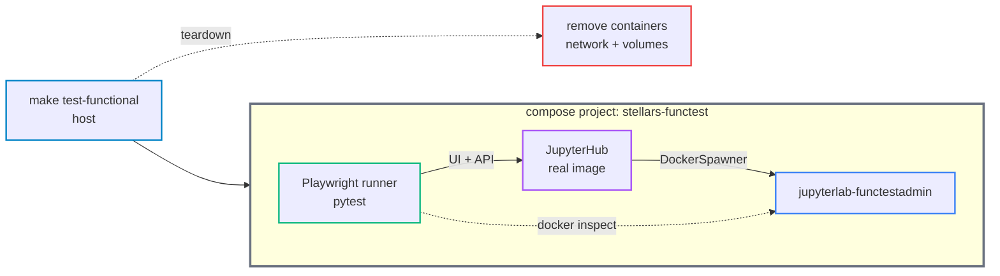

# Functional Test System

A local-only regression harness that boots the built hub image in a throwaway, fully isolated deployment and drives the running platform end-to-end with a containerized Playwright runner. It exists to validate fundamental rebuilds; GitHub runners cannot run the DockerSpawner deployment, so it never runs in CI (the pytest unit suites do).

## Construction

- **Two services** in `tests/functional/compose.functional.yml` - the real `stellars/stellars-jupyterhub-ds:latest` hub and a Playwright runner (`mcr.microsoft.com/playwright/python`), both on a test-only network
- **Isolated** - own compose project `stellars-functest`, own network `stellars-functest_network`, project-namespaced volumes, dedicated admin `functestadmin`, no published host port
- **Runner reaches the hub by service name** (`http://jupyterhub:8000/jupyterhub`) and holds the docker socket, so it can `inspect`/`exec` spawned labs
- **No host deps** - browser, deps and the whole flow run in containers

## How it works

- **Portal is a React SPA** - the tests drive the live single-page portal at `/jupyterhub/hub/<route>` with Playwright. There are no data-testids; selectors are visible text, antd roles (`aria-label`), and input placeholders. A direct GET of `/hub/login` self-redirects (the auth shell appends `?next=<self>`), so the browser is authenticated by injecting the API session's hub cookies rather than driving the login form; page readiness waits on the SPA `.ant-layout` shell, never `networkidle` (the SPA polls in the background)
- **Admin bootstrap** - signup mode signs up the first admin during the bootstrap window; env and signup-open modes env-provision the admin via restart-to-provision (`is_authorized=1`), since the bootstrap window is closed when an env password is set or signup is enabled
- **Per-test isolation** - an autouse fixture wipes all groups (admin API) before and after each test, so tests are independent
- **Policy -> container** - the core check: configure a group, add the admin, spawn, then `docker inspect` the container and assert the resolved policy landed (env, mounts, memory, labels). DockerSpawner sets this at container-create, so it is asserted without waiting for the lab app
- **Three setups (initial conditions), one by one** - `make test-functional-all` loops them, cleaning between each and reporting which passed / exiting non-zero if any failed: signup-bootstrap (the full SPA UI suite + container policy), env-password admin (restart-to-provision; one focused login test), and signup-open (signup enabled; a non-admin self-signs-up and the admin authorises through the SPA Users page). A conftest collection hook runs only the tests each regime owns (`FUNCTEST_AUTH_MODE`)
- **GPU** - `make test-functional` auto-detects a host GPU and, when present, runs the GPU auto-detection test (reads the hub `[GPU debug]` startup line); on CPU-only hosts that test is deselected
- **Acceptance-criteria coverage** - every test declares the acc-crit it covers via `@pytest.mark.acc_crit("<doc-slug>::<label>", ...)`; the declaration is mandatory (a marker-less collected test aborts the run) and the suite prints a `MET`/`UNMET` coverage report per criterion at conclusion
- **No skip noise** - a conftest collection hook deselects (never skips) tests outside the run's regime
- **Teardown** - on pass or fail, removes the project's containers, spawned labs, network and volumes; pulled images are kept (`REMOVE_IMAGES=1` to drop them); the operator's real deployment is never touched

## Running

- `make test-functional-all` - run every setup (signup, env, signup-open) one by one, cleaning between each; reports which passed
- `make test-functional` - the signup-bootstrap setup: boot, run the full SPA suite + container policy, clean up
- `make test-functional-env` - the env-password admin mode (one quick test)
- `make test-functional-signup-open` - signup enabled; self-signup + admin authorises via the SPA
- `make test-functional-clean` - force-remove a leftover harness
- `PYTEST_ARGS="-k ..."` - selective re-run; the default always runs all
- `FUNCTEST_GPU_ENABLED=2` - force GPU mode (otherwise auto-detected)

## Layout

- `compose.functional.yml` + `compose.functional-env.yml` + `compose.functional-signup-open.yml` - the stack and the env / signup-open overrides
- `conftest.py` - fixtures (health wait, admin bootstrap, cookie-injected `admin_page`/`admin_portal` SPA driver, `signup_user`, `clean_groups`, `admin_api`, `docker_client`) + the regime deselection hook
- `test_hub_ui.py` - login shell + per-page SPA render smoke (dashboard, servers, users, groups, events, notifications, settings, lab setup, design language)
- `test_scenarios.py` - SPA group lifecycle: create, policy badges from the server summary, priority reorder, delete
- `test_events.py` - event-log render + clear-log flow (persistent store wipe)
- `test_container_policy.py` - group config asserted on the spawned container (API + `docker inspect`)
- `test_signup_open.py` - signup-open self-signup + admin authorise
- `test_gpu_detection.py` / `test_auth_env_mode.py` - conditional GPU and env-auth tests
- `docs/acc-crit-functional-test-harness.md` - the full test/scenario catalogue
