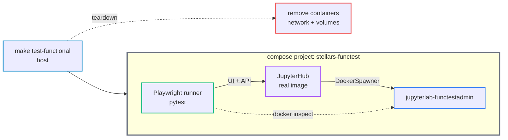

# Functional Test System

A local-only regression harness that boots the built hub image in a throwaway, fully isolated deployment and drives the running platform end-to-end with a containerized Playwright runner. It exists to validate fundamental rebuilds; GitHub runners cannot run the DockerSpawner deployment, so it never runs in CI (the pytest unit suites do).

## Construction

- **Two services** in `tests/functional/compose.functional.yml` - the real `stellars/stellars-jupyterhub-ds:latest` hub and a Playwright runner (`mcr.microsoft.com/playwright/python`), both on a test-only network
- **Isolated** - own compose project `stellars-functest`, own network `stellars-functest_network`, project-namespaced volumes, dedicated admin `functestadmin`, no published host port
- **Runner reaches the hub by service name** (`http://jupyterhub:8000/jupyterhub`) and holds the docker socket, so it can `inspect`/`exec` spawned labs
- **No host deps** - browser, deps and the whole flow run in containers

## How it works

- **Admin bootstrap** - on a fresh DB the env-password path cannot seed (the `users_info` table is created after the config runs), so a fixture creates the first admin via the signup window, then authenticates
- **Per-test isolation** - an autouse fixture wipes all groups (admin API) before and after each test, so tests are independent
- **Policy -> container** - the core check: configure a group, add the admin, spawn, then `docker inspect` the container and assert the resolved policy landed (env, mounts, memory, labels). DockerSpawner sets this at container-create, so it is asserted without waiting for the lab app
- **Two auth modes** - default signup-bootstrap; `make test-functional-env` does a restart-to-provision and runs one focused env-password test (it does not re-run the suite under a second regime)
- **GPU** - `make test-functional` auto-detects a host GPU and, when present, runs the GPU auto-detection test (reads the hub `[GPU debug]` startup line); on CPU-only hosts that test is deselected
- **No skip noise** - a conftest collection hook deselects (never skips) tests outside the run's regime
- **Teardown** - on pass or fail, removes the project's containers, spawned labs, network and volumes; pulled images are kept (`REMOVE_IMAGES=1` to drop them); the operator's real deployment is never touched

## Running

- `make test-functional` - boot, run everything, clean up; prints the total time
- `make test-functional-env` - the env-password admin mode (one quick test)
- `make test-functional-clean` - force-remove a leftover harness
- `PYTEST_ARGS="-k ..."` - selective re-run; the default always runs all
- `FUNCTEST_GPU_ENABLED=2` - force GPU mode (otherwise auto-detected)

## Layout

- `compose.functional.yml` / `compose.functional-env.yml` - the stack and the env-mode override
- `conftest.py` - fixtures (health wait, admin login, `clean_groups`, `admin_api`, `docker_client`) + the regime deselection hook
- `test_hub_ui.py` - hub pages and the group/policy lifecycle
- `test_scenarios.py` - multi-policy badges + tooltip, priority reorder
- `test_container_policy.py` - group config asserted on the spawned container
- `test_gpu_detection.py` / `test_auth_env_mode.py` - conditional GPU and env-auth tests
- `docs/acc-crit-functional-test-harness.md` - the full test/scenario catalogue
