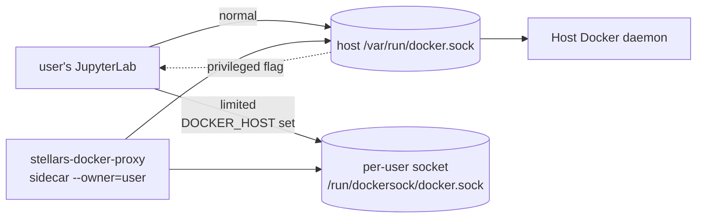

# JupyterHub Working With Docker

How a user's JupyterLab container ends up with (or without) Docker access. Three orthogonal-but-coupled grants on the per-group config: `docker_access` (normal), `docker_limited` (proxy), `docker_privileged` ("root"). The four user-visible modes and the across-group resolution that produces them.

## Modes

| Mode | What the user gets | Security |
|---|---|---|
| none | no docker socket inside the container | safest |
| `docker_access` | raw `/var/run/docker.sock` mounted - user sees every container/volume/network on the host, can `docker run` anything except `--privileged` from outside | wide |
| `docker_limited` | per-user proxy socket at `/run/dockersock/docker.sock` (`DOCKER_HOST` set) - user sees only resources labelled `stellars.owner=<them>`, creates are quota-bounded and stamped with the owner label, dangerous flags rejected (host bind, host net, cap-add, `--privileged`) | tight |
| `docker_privileged` standalone | the user's JupyterLab container itself runs with `--privileged` (kernel-root inside it) but **no Docker socket of any kind** - they can install host modules, mount loop devices, etc., from within their lab but cannot talk to dockerd | wide-inside-container |
| any access + `docker_privileged` | as above plus a docker socket (limited or raw). Does **not** change which socket they reach: limited stays limited, normal stays normal. Privileged is escalation, not bypass | wide |

## Allowed combinations (per group)

The Groups UI and `validate_docker_selection` enforce these:

| Normal | Limited | Root | UI shorthand |
|---|---|---|---|
| 0 | 0 | 0 | (no docker) |
| 1 | 0 | 0 | Docker |
| 0 | 1 | 0 | Docker limited |
| 0 | 0 | 1 | Docker root (privileged container only, no socket) |
| 1 | 0 | 1 | Docker + Docker root |
| 0 | 1 | 1 | Docker limited + Docker root |

Within one group: normal and limited are mutually exclusive. Root is fully orthogonal - it may stand on its own (a `docker-root` group that grants only `--privileged`) and combine across groups with `docker-access` or `docker-limited` from another group.

## Across-group resolution

A user can be in several groups. `group_resolver.resolve_group_config` merges them:

- `docker_access`, `docker_limited`, `docker_privileged` are OR-accumulated
- If both `docker_access` and `docker_limited` end up True after OR, **normal supersedes limited** - the proxy is moot once a raw socket is mounted; resolver sets `docker_limited=False`
- `docker_privileged` is orthogonal - it OR-accumulates regardless of which access mode wins
- limited quotas (containers, volumes, networks, storage, cpu cap, mem cap) are max-wins across groups that grant limited

## Architecture

The sidecar is launched on first spawn by `pre_spawn_hook` via `ensure_user_proxy`; reused on subsequent spawns; removed on `post_stop_hook`. It runs from the hub's own image (which has `stellars_docker_proxy` installed).

## Common gotcha

Putting a user in BOTH a limited group AND a group that carries `docker_access=True` produces the bonanza, not the limited+root state. The "normal supersedes limited" rule fires across groups, collapsing limited to False. The legacy `docker-privileged` group historically carries `docker_access=True` together with `docker_privileged=True` - a user in `docker-limited` + `docker-privileged` ends up on the raw socket, not the proxy. To get limited + root, either keep the user out of any normal-granting group, or split root into its own group that does **not** also grant access.

## Where the rules live

- Group field defaults: `services/jupyterhub/stellars-hub-services/stellars_hub_services/groups_config.py` (`default_config`, `validate_docker_selection`)
- Across-group resolution: `services/jupyterhub/stellars-hub-services/stellars_hub_services/group_resolver.py` (`resolve_group_config`)
- Spawn-time application: `services/jupyterhub/stellars-hub-services/stellars_hub_services/hooks.py` (`pre_spawn_hook` - mounts the right socket, sets `DOCKER_HOST`, applies `--privileged`)
- Sidecar orchestration: `services/jupyterhub/stellars-hub-services/stellars_hub_services/docker_proxy.py` (`ensure_user_proxy`, `stop_user_proxy`)
- Proxy itself: `services/jupyterhub/stellars-docker-proxy/` (JupyterHub-agnostic aiohttp filter)

## Related

- `limited-docker-access.md` - deep dive on the proxy package and request flow
- `docker-socket-permissions.md` - tabular field reference
