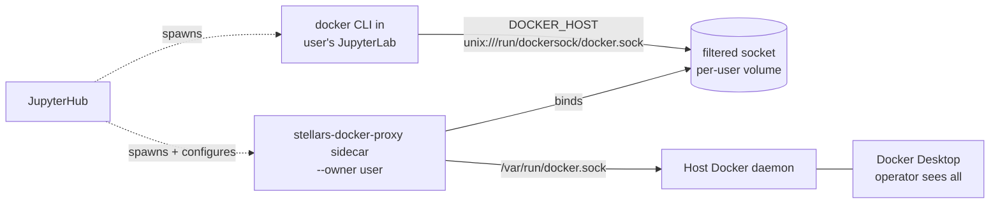
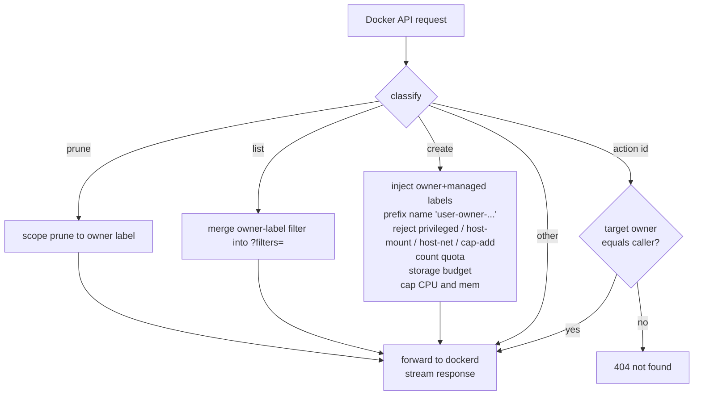

# Limited Docker Access

Per-user filtered Docker socket. A user in a `docker-limited` group manages only their own containers/volumes/networks up to a quota. All resources run on the host Docker daemon, so the operator sees everything in Docker Desktop; the user sees only theirs.

## Architecture

## Group config (admin UI: `/hub/groups`)

Three Docker fields, with the four valid combinations spelled out in the UI:

| `docker_access` | `docker_limited` | `docker_privileged` | UI shorthand |
|---|---|---|---|
| 1 | 0 | 0 | Docker |
| 0 | 1 | 0 | Docker limited |
| 1 | 0 | 1 | Docker + Docker root |
| 0 | 1 | 1 | Docker limited + Docker root |

- `docker_access` - normal access: raw `/var/run/docker.sock` (sees all, no quota)
- `docker_limited` - per-user filtered socket (this feature)
- `docker_privileged` - **"Docker (root)"**: runs the user container with `--privileged`. This is a privilege escalation of an existing grant, not a third independent option. It does **not** bypass the proxy on a limited grant - it raises the user container's kernel privileges so docker commands inside it have root on the host kernel
- limited quota/caps: `max_containers` (10), `max_volumes` (10), `max_networks` (3), `max_storage_gb` (50, soft), `cpu_cap_cores` (2), `mem_cap_gb` (8 per created container)

The UI exposes the rules directly: normal and limited are mutually exclusive within a group; the **Docker (root)** checkbox is disabled (and auto-unchecked) when neither is selected. The features pill on the groups table is a single `Docker` chip whenever any of the three is on - it indicates "this group has Docker config" without revealing flavour.

## Precedence

- Across groups: normal supersedes limited (raw socket makes the proxy moot); grants OR; quotas max-wins
- Within a group: normal XOR limited
- Docker (root) requires normal or limited in the same group (validated server-side: `invalid_docker_selection`); across groups it OR-accumulates with the access grants from the other groups

## Labels stamped on every create

- `stellars.owner=<user>` - identity, used for all filtering
- `stellars.managed=true` - proxy-created (for janitors)
- `com.docker.compose.project=<configured>` - ad-hoc grouping in Docker Desktop; **not** overridden if the user is running their own `docker compose` (project + names preserved)

## Request flow

## Endpoint behaviour

| Endpoint | Behaviour |
|---|---|
| `POST /containers\|volumes\|networks/create` | inject labels; count quota; storage budget (containers, volumes); containers also: name prefix, dangerous-flag check, image allowlist, CPU/mem cap |
| `GET /containers/json`, `/volumes`, `/networks` | inject `label=stellars.owner=<user>` into `?filters=` |
| `GET/POST/DELETE /containers\|volumes\|networks/{id}/...` | inspect target, 404 if not owned, else forward |
| `POST /containers\|volumes\|networks/prune` | inject owner label into `?filters=` so prune is owner-scoped |
| `POST /images/create` (`docker pull`) | image allowlist (if configured), else forward |
| everything else | streamed pass-through |

## Sidecar lifecycle

- Image: the hub's own image (detected via `container.image.tags`); has `stellars_docker_proxy` installed
- Name: `jupyterlab-<base>-dockerproxy`; shared volume `jupyterlab-<base>_dockersock` mounted at `/run/dockersock` in both sidecar and user container
- Started on `pre_spawn_hook` for limited users (idempotent: existing sidecar is reused, only started if stopped)
- `restart_policy: unless-stopped`
- Removed on `post_stop_hook` (user-created containers persist)

## Modules

| Module | Role |
|---|---|
| `stellars_docker_proxy.config` | `ProxyConfig` + label constants |
| `stellars_docker_proxy.filters` | pure transforms (label injection, list filter, caps check/apply, dangerous, ownership, compose project) |
| `stellars_docker_proxy.quota` | pure accounting (counts, `/system/df` storage per owner) |
| `stellars_docker_proxy.server` | aiohttp reverse proxy: classify -> mutate/guard/quota -> stream; optional `owner_resolver` hook for per-request identity |
| `stellars_docker_proxy.__main__` | CLI `python -m stellars_docker_proxy --owner ... --listen-socket ...` |
| `stellars_hub.docker_proxy` | `detect_self_image`, `ensure_user_proxy`, `stop_user_proxy` (sidecar orchestration via the docker SDK) |
| `stellars_hub.group_resolver` | `docker_limited` + quota max-wins + normal-supersedes-limited precedence |
| `stellars_hub.groups_config` | default fields + `validate_docker_selection` (mutual exclusivity) |
| `stellars_hub.hooks` | 3-branch docker block (normal / limited / none) |

## Configuration

| Env | Default | Purpose |
|---|---|---|
| `JUPYTERHUB_DOCKER_PROXY_IMAGE` | hub's image (auto-detected) | image running the sidecar |
| `JUPYTERHUB_NETWORK_NAME` | `jupyterhub_network` | network the sidecar joins |
| `COMPOSE_PROJECT_NAME` | `jupyterhub` | compose project stamped on ad-hoc creates |

## Caveats

- Name prefix avoids cross-user collisions on the shared daemon; `docker stop foo` won't match - users reference the name shown in `docker ps`
- `DOCKER_HOST` points at `unix:///run/dockersock/docker.sock` (not literally `/var/run/docker.sock` - mounting a volume at `/var/run` would clobber it)
- `/system/df` is queried per create for the storage budget - latency on busy hosts
- Interactive TTY hijack (`exec -it`, `attach`) is not specially handled in v1; non-interactive streams work
- The proxy binds its socket a beat after spawn; benign for interactive use

## Identity model

The proxy itself knows only an `owner` string; no JupyterHub notion. Today: one sidecar per user, owner baked at start. Future token-roundtrip resolution lives in `stellars_hub` via the `owner_resolver(request)` hook on `create_app()` - the proxy package never changes.

## Related

- `gpu-detection-and-configuration.md`
- `gpu-selection-jupyterlab-containers.md`
