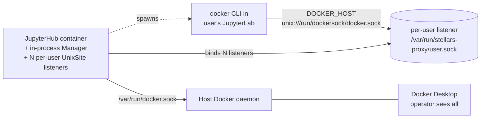
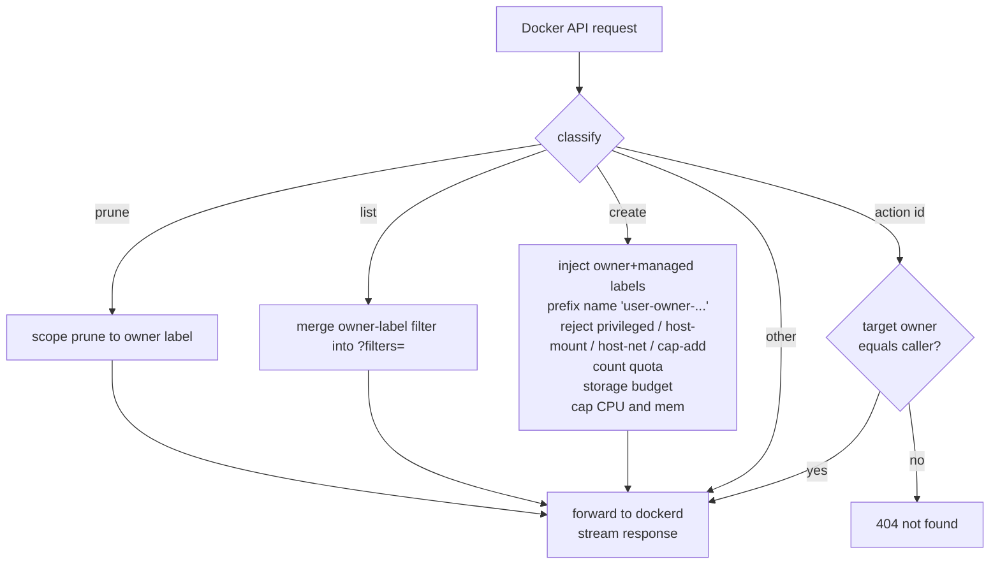

# Limited Docker Access

Per-user filtered Docker socket. A user in a `docker-limited` group manages only their own containers/volumes/networks up to a quota. All resources run on the host Docker daemon, so the operator sees everything in Docker Desktop; the user sees only theirs.

## Architecture

## Group config (admin UI: `/hub/groups`)

Three Docker fields. All valid within-a-group combinations:

| `docker_access` | `docker_limited` | `docker_privileged` | UI shorthand |
|---|---|---|---|
| 1 | 0 | 0 | Docker |
| 0 | 1 | 0 | Docker limited |
| 0 | 0 | 1 | Docker root (privileged container only, no socket) |
| 1 | 0 | 1 | Docker + Docker root |
| 0 | 1 | 1 | Docker limited + Docker root |

- `docker_access` - normal access: raw `/var/run/docker.sock` (sees all, no quota)
- `docker_limited` - per-user filtered socket (this feature)
- `docker_privileged` - **"Docker (root)"**: runs the user container with `--privileged`. Fully orthogonal: standalone in a group it gives kernel-root inside the lab with no Docker socket; combined with normal or limited (same group or another the user belongs to) it escalates that access mode. It does **not** bypass the proxy on a limited grant
- limited quota/caps: `max_containers` (10), `max_volumes` (10), `max_networks` (3), `max_storage_gb` (50, soft), `cpu_cap_cores` (2), `mem_cap_gb` (8 per created container)

The UI rule: normal and limited are mutually exclusive within a group; Docker (root) is freely selectable on its own or with either. The features pill on the groups table is a single `Docker` chip whenever any of the three is on - it indicates "this group has Docker config" without revealing flavour.

## Precedence

- Across groups: normal supersedes limited (raw socket makes the proxy moot); grants OR; quotas max-wins
- Within a group: normal XOR limited
- Docker (root) is fully orthogonal: it OR-accumulates across groups and may stand alone in a group (granting `--privileged` with no Docker socket)

## Labels stamped on every create

- `stellars.owner=<user>` - identity, used for all filtering
- `stellars.managed=true` - proxy-created (for janitors)
- `com.docker.compose.project=<configured>` - ad-hoc grouping in Docker Desktop; **not** overridden if the user is running their own `docker compose` (project + names preserved)

## Request flow

## Endpoint behaviour

| Endpoint | Behaviour |
|---|---|
| `POST /containers\|volumes\|networks/create` | inject labels; count quota; storage budget (containers, volumes); containers also: name prefix, dangerous-flag check, image allowlist, CPU/mem cap |
| `GET /containers/json`, `/volumes`, `/networks` | inject `label=stellars.owner=<user>` into `?filters=` |
| `GET/POST/DELETE /containers\|volumes\|networks/{id}/...` | inspect target, 404 if not owned, else forward |
| `POST /containers\|volumes\|networks/prune` | inject owner label into `?filters=` so prune is owner-scoped |
| `POST /images/create` (`docker pull`) | image allowlist (if configured), else forward |
| everything else | streamed pass-through |

## Lifecycle

- The proxy is **embedded in the hub container** - no second compose service, no admin HTTP, no token. The module-singleton `Manager` lives in the hub's own asyncio event loop alongside the activity sampler and idle culler
- On `pre_spawn_hook` the hub does `await register_user(...)` directly - the Manager creates a per-user `UnixSite` listener at `/var/run/stellars-proxy/<user>.sock` with the resolved quotas. Re-register is idempotent: replaces the previous listener so quota changes apply on the user's next spawn
- The spawner bind-mounts that single socket file from the host into the user container at `/run/dockersock/docker.sock`; `DOCKER_HOST` points at it
- On `post_stop_hook` the hub does `await unregister_user(...)`; the listener tears down and the socket file is removed
- Hub restart wipes all listeners (stateless); the next spawn re-registers automatically via `pre_spawn_hook`

## Modules

| Module | Role |
|---|---|
| `stellars_docker_proxy.config` | `ProxyConfig` + label constants |
| `stellars_docker_proxy.filters` | pure transforms (label injection, list filter, caps check/apply, dangerous, ownership, compose project) |
| `stellars_docker_proxy.quota` | pure accounting (counts, `/system/df` storage per owner) |
| `stellars_docker_proxy.server` | aiohttp reverse proxy: classify -> mutate/guard/quota -> stream; `create_app(ProxyConfig)` returns a per-owner app |
| `stellars_docker_proxy.manager` | `Manager` holds N per-user listeners in one process; register/unregister lifecycle |
| `stellars_hub_services.docker_proxy` | module-singleton `Manager` + `register_user`/`unregister_user` (async, direct Manager calls) |
| `stellars_hub_services.group_resolver` | `docker_limited` + quota max-wins + normal-supersedes-limited precedence |
| `stellars_hub_services.groups_config` | default fields + `validate_docker_selection` (mutual exclusivity) |
| `stellars_hub_services.hooks` | 3-branch docker block (normal / limited / none); awaits `register_user` |

## Configuration

There is exactly one knob, and it's baked into the image. Operators do nothing:

| Env | Default | Purpose |
|---|---|---|
| `JUPYTERHUB_DOCKER_PROXY_SOCKET_DIR` | `/var/run/stellars-proxy` | Set in `Dockerfile.jupyterhub` as an `ENV`. Host directory where the in-process proxy writes per-user sockets, and source path the spawner bind-mounts from into user containers. Override only at image build time if you really need a different host path; matching compose bind-mount must change too |
| `COMPOSE_PROJECT_NAME` | `jupyterhub` | compose project stamped on ad-hoc creates |

Compose-side: the hub container has a single host bind `/var/run/stellars-proxy:/var/run/stellars-proxy` that exposes the proxy's socket directory to DockerSpawner. No second container, no token, no `.env` change needed.

## Caveats

- Name prefix avoids cross-user collisions on the shared daemon; `docker stop foo` won't match - users reference the name shown in `docker ps`
- `DOCKER_HOST` points at `unix:///run/dockersock/docker.sock` (not literally `/var/run/docker.sock` - mounting a volume at `/var/run` would clobber it)
- `/system/df` is queried per create for the storage budget - latency on busy hosts
- Interactive TTY hijack (`exec -it`, `attach`) is not specially handled in v1; non-interactive streams work
- Hub restart wipes all listeners; running limited users need to restart their labs to be re-registered. Acceptable since a hub restart already stops all user spawners
- Process-compromise blast radius: a proxy bug inside the hub process can affect the hub itself. v1 acceptable trade-off for the convenience-driven model; the proxy code is small, well-tested, and entirely on the same loop as the hub's existing services

## Identity model

The proxy library itself knows only an `owner` string; no JupyterHub notion. Inside the hub process, the `Manager` holds N per-user `ProxyApp` instances, each bound to its own unix listener at `/var/run/stellars-proxy/<owner>.sock`. Identity is baked into the listener: whichever container mounts a given socket file acts as that owner. There is no per-request authentication on the data path; access control is the bind-mount choice the spawner makes.

## Related

- `gpu-detection-and-configuration.md`
- `gpu-selection-jupyterlab-containers.md`
