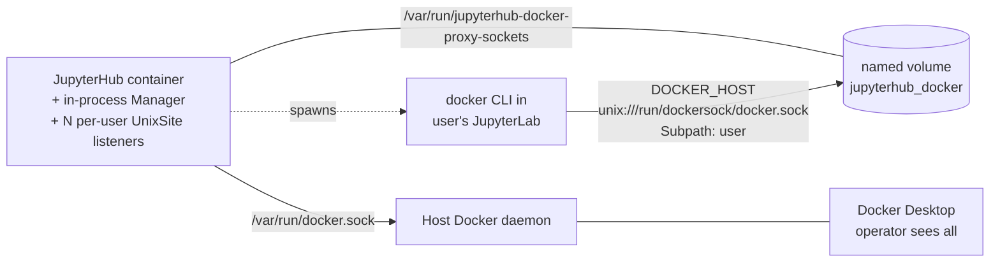
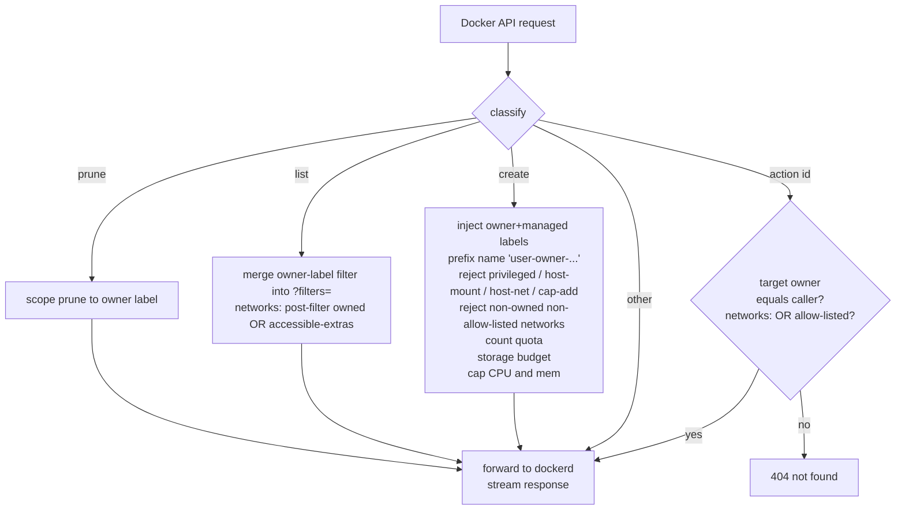

# Limited Docker Access

Per-user filtered Docker socket. A user in a `docker-limited` group manages only their own containers/volumes/networks up to a quota. All resources run on the host Docker daemon, so the operator sees everything in Docker Desktop; the user sees only theirs.

## Architecture



## Group config (admin UI: `/hub/groups`)

Three Docker fields. All valid within-a-group combinations:

| `docker_access` | `docker_limited` | `docker_privileged` | UI shorthand |
|---|---|---|---|
| 1 | 0 | 0 | Docker |
| 0 | 1 | 0 | Docker limited |
| 0 | 0 | 1 | Docker root (privileged container only, no socket) |
| 1 | 0 | 1 | Docker + Docker root |
| 0 | 1 | 1 | Docker limited + Docker root |

- `docker_access` - normal access: raw `/var/run/docker.sock` (sees all, no quota)
- `docker_limited` - per-user filtered socket (this feature)
- `docker_privileged` - **"Docker (root)"**: runs the user container with `--privileged`. Fully orthogonal: standalone in a group it gives kernel-root inside the lab with no Docker socket; combined with normal or limited (same group or another the user belongs to) it escalates that access mode. It does **not** bypass the proxy on a limited grant
- limited quota/caps: `max_containers` (10), `max_volumes` (10), `max_networks` (3), `max_storage_gb` (50, soft), `cpu_cap_cores` (2), `mem_cap_gb` (8 per created container)

The UI rule: normal and limited are mutually exclusive within a group; Docker (root) is freely selectable on its own or with either. The features pill on the groups table is a single `Docker` chip whenever any of the three is on - it indicates "this group has Docker config" without revealing flavour.

## Precedence

- Across groups: normal supersedes limited (raw socket makes the proxy moot); grants OR; quotas max-wins
- Within a group: normal XOR limited
- Docker (root) is fully orthogonal: it OR-accumulates across groups and may stand alone in a group (granting `--privileged` with no Docker socket)

## Labels stamped on every create

- `jupyterhub.docker.proxy.owner=<user>` - identity, used for all filtering
- `jupyterhub.docker.proxy.managed=true` - proxy-created (for janitors)
- `com.docker.compose.project=<per-user-project>` - per-user compose project rendered from `JUPYTERHUB_DOCKER_PROXY_USER_COMPOSE_PROJECT_TEMPLATE` when `docker_limited_user_compose_project_enabled=True` (default). With `_allow_override=True` (default) the user's own `docker compose -p <name>` / `COMPOSE_PROJECT_NAME=<name>` is respected; with `_allow_override=False` (strict) the user's label is REWRITTEN. With `_enabled=False` the label is not set at all (ad-hoc containers are free-floating)

## Request flow



## Endpoint behaviour

| Endpoint | Behaviour |
|---|---|
| `POST /containers\|volumes\|networks/create` | inject labels; count quota; storage budget (containers, volumes); containers also: name prefix, dangerous-flag check, image allowlist, CPU/mem cap, network-access check (`HostConfig.NetworkMode` and `NetworkingConfig.EndpointsConfig` must reference a built-in mode, an owner-labelled network, or an entry of `extra_accessible_networks`; else 403) |
| `GET /containers/json`, `/volumes` | inject `label=jupyterhub.docker.proxy.owner=<user>` into `?filters=` |
| `GET /networks` | inject owner-label filter normally; when `extra_accessible_networks` is non-empty, buffer the response and post-filter to `is_owned(owner) OR Name in extras` instead (so the user sees their own networks AND the hub network) |
| `GET/POST/DELETE /containers\|volumes/{id}/...` | inspect target, 404 if not owned, else forward |
| `GET/POST/DELETE /networks/{id}/...` (incl. `/connect`, `/disconnect`) | inspect target, 404 if not owned AND not in `extra_accessible_networks`, else forward |
| `POST /containers\|volumes\|networks/prune` | inject owner label into `?filters=` so prune is owner-scoped |
| `POST /images/create` (`docker pull`) | image allowlist (if configured), else forward |
| everything else | streamed pass-through |

## Lifecycle

- The proxy is **embedded in the hub container** - no second compose service, no admin HTTP, no token. The module-singleton `Manager` lives in the hub's own asyncio event loop alongside the activity sampler and idle culler
- The socket directory `/var/run/jupyterhub-docker-proxy-sockets` inside the hub is backed by a named docker volume `jupyterhub_docker` (declared in `compose.yml`, managed by Docker, no host path)
- On `pre_spawn_hook` the hub does `await register_user(...)` directly - the Manager creates a per-user `UnixSite` listener at `/var/run/jupyterhub-docker-proxy-sockets/<user>/docker.sock` with the resolved quotas. Re-register is idempotent: replaces the previous listener so quota changes apply on the user's next spawn
- The spawner mounts the same named volume into the user container with `Subpath: <user>`, so each lab sees ONLY its own subdirectory under `/run/dockersock/` containing the single `docker.sock` it's allowed to talk to. Mount-level isolation, no cross-user visibility
- On `post_stop_hook` the hub does `await unregister_user(...)`; the listener tears down, the socket file is removed, and the now-empty per-user subdirectory is cleaned up too
- Hub restart wipes all listeners (stateless); the next spawn re-registers automatically via `pre_spawn_hook`

## Modules

| Module | Role |
|---|---|
| `duoptimum_docker_proxy.config` | `ProxyConfig` + label constants |
| `duoptimum_docker_proxy.filters` | pure transforms (label injection, list filter, caps check/apply, dangerous, ownership, compose project) |
| `duoptimum_docker_proxy.quota` | pure accounting (counts, `/system/df` storage per owner) |
| `duoptimum_docker_proxy.server` | aiohttp reverse proxy: classify -> mutate/guard/quota -> stream; `create_app(ProxyConfig)` returns a per-owner app |
| `duoptimum_docker_proxy.manager` | `Manager` holds N per-user listeners in one process; register/unregister lifecycle |
| `duoptimum_hub_services.docker_proxy` | module-singleton `Manager` + `register_user`/`unregister_user` (async, direct Manager calls) |
| `duoptimum_hub_services.group_resolver` | `docker_limited` + quota max-wins + normal-supersedes-limited precedence |
| `duoptimum_hub_services.groups_config` | default fields + `GroupConfigValidator` (GPU / Docker / CPU / Mem coherence) |
| `duoptimum_hub_services.hooks` | 3-branch docker block (normal / limited / none); awaits `register_user` |

## Configuration

### Platform settings

Baked into the image as Dockerfile `ENV`s or computed in Python. Operators do nothing:

| Setting | Where | Value | Purpose |
|---|---|---|---|
| `JUPYTERHUB_DOCKER_PROXY_SOCKET_DIR` | `Dockerfile.jupyterhub` `ENV` | `/var/run/jupyterhub-docker-proxy-sockets` | Path inside the hub container where the in-process proxy writes per-user listener sockets. Backed by a named docker volume - not a host path |
| `JUPYTERHUB_DOCKER_PROXY_SOCKETS_VOLUME` | `config/jupyterhub_config.py` (computed) | `f"{COMPOSE_PROJECT_NAME}_jupyterhub_docker"` | Actual on-daemon name of the named docker volume that backs the socket directory. Not operator-configurable - computed to match compose's automatic project-prefix namespacing of the `jupyterhub_docker:` volume declared in `compose.yml`. Follows the same convention as `f"{COMPOSE_PROJECT_NAME}_jupyterhub_shared"` in `DOCKER_SPAWNER_VOLUMES`. The spawner subpath-mounts this volume into each lab so each lab sees only its own subdirectory |
| `JUPYTERHUB_DOCKER_PROXY_USER_COMPOSE_PROJECT_TEMPLATE` | `Dockerfile.jupyterhub` `ENV` | `{username}_containers` | Python `str.format` template rendered into the per-user `com.docker.compose.project` label stamped on ad-hoc `docker run` containers when a docker-limited group enables enforcement (see below). Placeholders: `{compose_project}` (hub project) and `{username}` (lab owner). Operator can override in `compose.yml` to e.g. `{compose_project}_{username}_containers` for cross-deployment disambiguation |
| `JUPYTERHUB_DOCKER_PROXY_LABEL_PREFIX` | `Dockerfile.jupyterhub` `ENV` | `jupyterhub.docker.proxy` | Label namespace; proxy stamps `<prefix>.owner=<user>` (all filtering keys off this) and `<prefix>.managed=true` on its resources. Override to dodge clashes with host labels; changing it needs a lab restart (existing resources keep old labels until recreated) |
| `COMPOSE_PROJECT_NAME` | compose-passthrough env | required, no default | Drives docker compose project label and volume namespacing. Empty raises `RuntimeError` at hub startup - silent fallback would mismatch compose's namespacing and fail spawns at Subpath resolution |

Compose-side: a single named volume `jupyterhub_docker` is declared at the bottom of `compose.yml`; compose namespaces it on the daemon to `${COMPOSE_PROJECT_NAME}_jupyterhub_docker` and mounts it on the hub at the socket-dir path. No host bind, no second container, no token, no `.env` change. To wipe state, operator can `docker volume rm ${COMPOSE_PROJECT_NAME}_jupyterhub_docker` (must be down first).

### Per-group docker-limited settings

Stored in `groups_config.sqlite` per group, surfaced on `/hub/groups` for admin editing.

> **Across groups: most permissive wins.** Toggles OR-accumulate (any group on -> on); quotas max-win. Standard supersedes Limited; Privileged is orthogonal. Per-row **Composes** line below restates the rule.

| Field | Default | Purpose |
|---|---|---|
| `docker_limited` | `False` | Grants this group's users the per-user proxy socket. **Composes**: any group on -> on; suppressed when any group grants Standard `docker_access` |
| `docker_limited_max_containers` / `_volumes` / `_networks` | 10 / 10 / 3 | Hard quotas - create rejected at the cap. **Composes**: max-wins across granting groups |
| `docker_limited_max_storage_gb` | 50 | Soft budget - new creates blocked once measured usage exceeds it. **Composes**: max-wins |
| `docker_limited_cpu_cap_cores` / `_mem_cap_gb` | 2 / 8 | Per-container caps; applied as defaults and rejected when the user requests more. **Composes**: max-wins per cap |
| `docker_limited_allow_dangerous_flags` | `False` | **Warning - escape-hatch grant.** When `True`, the proxy stops rejecting host bind mounts, host network/PID namespaces, added capabilities, and device passthrough on the user's sub-containers. Ownership labelling and quota caps still apply. Independent of `docker_privileged`. Use only when the user genuinely needs host paths / kernel devices in a sub-container. **Composes**: any group on -> on. **Access affected**: host binds, `--network host`, `--pid host`, `--cap-add`, `--device` accepted when ON; 403 on create when OFF |
| `docker_limited_user_compose_project_enabled` | `True` | When `True`, the proxy stamps ad-hoc `docker run` containers with a per-user `com.docker.compose.project` label rendered from `JUPYTERHUB_DOCKER_PROXY_USER_COMPOSE_PROJECT_TEMPLATE` (default `{username}_containers`), so each user's containers group under their own project in `docker compose ls` / Docker Desktop. **Composes**: any group on -> on. **Access affected**: none - cosmetic stamp. When OFF, ad-hoc containers carry no compose project label (free-floating). User's own `docker compose` projects unaffected either way |
| `docker_limited_user_compose_project_allow_override` | `True` | Only meaningful when `_enabled` is on. When `True`, a project label the user supplies via `docker compose -p <name>` OR `COMPOSE_PROJECT_NAME=<name>` is respected. When `False` (strict mode), the proxy REWRITES the user's label to the template-rendered per-user name regardless. **Composes**: any group on -> on (= user keeps control). **Access affected**: none - only visible project grouping changes |
| `docker_limited_hub_network_access` | `True` | When `True`, full access to the hub's docker network (name from `JUPYTERHUB_NETWORK_NAME`): visible in `docker network ls`, containers can `--network <hub-net>` on create, and `docker network connect <hub-net>` is forwarded. **Composes**: any group on -> on. **Access affected**: end-to-end gate. When OFF, hub network is hidden in list, creates referencing it (in `HostConfig.NetworkMode` or `NetworkingConfig.EndpointsConfig`) get 403 `network not accessible`, connect/disconnect actions get 404. Owned networks and built-in modes (`bridge` / `none` / `default` / `container:<id>`) always allowed |
| `docker_privileged` | `False` | Runs the user's own lab with `--privileged` (kernel-root inside the lab). Orthogonal to the access mode. When on, the proxy also accepts `--privileged` on sub-containers (their lab is already kernel-root). **Does NOT imply `docker_limited_allow_dangerous_flags`**. **Composes**: any group on -> on. **Access affected**: only the `Privileged: true` bit on container create |

### What the proxy enforces, and how each setting changes the gate

The proxy ALWAYS enforces these regardless of any toggle:

- Per-create quota counts (`max_containers` / `_volumes` / `_networks`)
- Per-create storage budget against `max_storage_gb` (queries `/system/df`)
- Per-container CPU and memory caps (`cpu_cap_cores` / `mem_cap_gb`)
- Owner labelling: every created container / volume / network gets `jupyterhub.docker.proxy.owner=<user>` and `jupyterhub.docker.proxy.managed=true`
- Owner-scope on list and prune: `docker ps` / `docker volume ls` / `docker network ls` / `docker container prune` etc. are filtered to the user's own resources
- Ownership check on actions: `docker stop/inspect/exec/rm <id>` on a non-owned target returns 404

What each toggle changes on top of that baseline is described in the "Access affected" line of its row above. Mapped to `ProxyConfig` in `_build_overrides`:

- `ProxyConfig.allow_privileged` <- `resolved['docker_privileged']`. Skips ONLY the `Privileged` rejection in `dangerous_reason()`.
- `ProxyConfig.allow_dangerous_flags` <- `resolved['docker_limited_allow_dangerous_flags']`. Skips host binds, host net/pid, cap-add, device passthrough in `dangerous_reason()`.
- `ProxyConfig.compose_project` <- per-user project rendered from the template when `resolved['docker_limited_user_compose_project_enabled']` is True; empty string otherwise (containers carry no compose-project label).
- `ProxyConfig.allow_compose_project_override` <- `resolved['docker_limited_user_compose_project_allow_override']`. Controls whether `inject_compose_project` REWRITES a user-provided project label.
- `ProxyConfig.extra_accessible_networks` <- `(hub_network_name,)` when `resolved['docker_limited_hub_network_access']` is True AND the hub knows its own network name; otherwise empty. Affects three places: list (post-filter `is_owned(owner) OR Name in extras`), action (allow connect/disconnect on networks in extras even if not owned), and container create (block `HostConfig.NetworkMode` / `NetworkingConfig.EndpointsConfig` references to non-built-in, non-owned, non-allow-listed networks with 403).

All five are independent.

### Group config validation

A single `GroupConfigValidator` class consolidates per-field coherence checks. The `/hub/groups` PUT handler calls `validate_all(merged)` and returns HTTP 400 with the failing error code on the first failure:

| Method | Error code | Checks |
|---|---|---|
| `validate_gpu` | `invalid_gpu_selection` | GPU access on + not "all" + no specific device id is incoherent |
| `validate_docker` | `invalid_docker_selection` | Normal + limited within one group is mutually exclusive; limited-quota fields must be numeric and non-negative |
| `validate_cpu` | `invalid_cpu_limit` | When `cpu_limit_enabled`, `cpu_limit_cores` must be a positive number |
| `validate_mem` | `invalid_mem_limit` | When `mem_limit_enabled`, `mem_limit_gb` must be a positive number |

Free functions `validate_gpu_selection(...)` and `validate_docker_selection(...)` remain as thin backward-compatible wrappers for existing callers and tests.

## Caveats

- Name prefix avoids cross-user collisions on the shared daemon; `docker stop foo` won't match - users reference the name shown in `docker ps`
- `DOCKER_HOST` points at `unix:///run/dockersock/docker.sock` (not literally `/var/run/docker.sock` - mounting a volume at `/var/run` would clobber it)
- `/system/df` is queried per create for the storage budget - latency on busy hosts
- Interactive TTY hijack (`exec -it`, `attach`) is not specially handled in v1; non-interactive streams work
- Hub restart wipes all listeners; running limited users need to restart their labs to be re-registered. Acceptable since a hub restart already stops all user spawners
- Process-compromise blast radius: a proxy bug inside the hub process can affect the hub itself. v1 acceptable trade-off for the convenience-driven model; the proxy code is small, well-tested, and entirely on the same loop as the hub's existing services

## Diagnostic endpoint (planned)

A future authenticated `GET /hub/api/admin/docker-proxy/status` (admin-only) will expose proxy state as JSON for triage and a possible future status page:

```json
{
  "socket_dir": "/var/run/jupyterhub-docker-proxy-sockets",
  "registered": [
    {
      "user": "konrad.jelen",
      "socket_path": "/var/run/jupyterhub-docker-proxy-sockets/konrad.jelen/docker.sock",
      "since": "2026-05-26T15:14:06Z",
      "config": {
        "max_containers": 4,
        "max_volumes": 4,
        "max_networks": 1,
        "max_storage_gb": 50.0,
        "cpu_cap_cores": 4.0,
        "mem_cap_gb": 16.0,
        "compose_project": "stellars-tech-ai-lab_konrad.jelen_containers",
        "allow_privileged": false,
        "allow_dangerous_flags": false,
        "allow_compose_project_override": true,
        "extra_accessible_networks": ["stellars-tech-ai-lab_network"]
      }
    }
  ]
}
```

Backed by `Manager.registered()` which already returns this shape. Auth uses the same admin-required decorator the existing `/hub/api/admin/*` handlers use. Until the endpoint lands, the same data is reachable via `docker exec <hub> ls -la /var/run/jupyterhub-docker-proxy-sockets/` (one socket file per registered user) and the per-spawn `[Groups]` log line that carries `docker_limits=[...]` inline. Not yet implemented.

## Identity model

The proxy library itself knows only an `owner` string; no JupyterHub notion. Inside the hub process, the `Manager` holds N per-user `ProxyApp` instances, each bound to its own unix listener at `/var/run/jupyterhub-docker-proxy-sockets/<owner>/docker.sock`. The per-user subdirectory exists so the named volume backing the socket directory can be subpath-mounted into each user lab - each lab sees ONLY its own subdirectory, so mount-level isolation prevents cross-user listener access. Identity is baked into the listener: whichever container mounts a given socket file acts as that owner. There is no per-request authentication on the data path; access control is the bind-mount choice the spawner makes.

## Related

- `gpu-detection-and-configuration.md`
- `gpu-selection-jupyterlab-containers.md`
