# Your Data Science Team Deserves a Self-Service Lab


*How we built a two-project ecosystem - JupyterHub for orchestration, JupyterLab for the workspace - that lets data scientists focus on science, not infrastructure*

---

## The Problem Nobody Talks About

Every data science team eventually hits the same wall. It's not the algorithms. It's not the data. It's the friction.

Someone needs a GPU for training. Another person broke their Python environment. A third one is asking IT to install a library they found on GitHub. Meanwhile, the DevOps engineer who set up the shared server two years ago has moved on, and nobody knows how the Conda environments are supposed to work.

If you've managed a data science team, you've lived through some version of this. The tools are powerful but fragile. The environments are personal but need to be reproducible. The compute is expensive but sits idle most of the time.

I decided to fix it. Not with a managed cloud service that costs a fortune, but with an open-source platform anyone could run on their own hardware, tune to their needs, and hand the keys to their team. The guiding principle was simple: eliminate every friction point between a data scientist and their work. Over three years of development, that translated into 40+ categories of enhancements - 21 JupyterLab extensions, 5 integrated background services, 43 pre-installed packages, and 14 custom API handlers - all wired together into a coherent ecosystem that data science teams worldwide now use for their daily work.

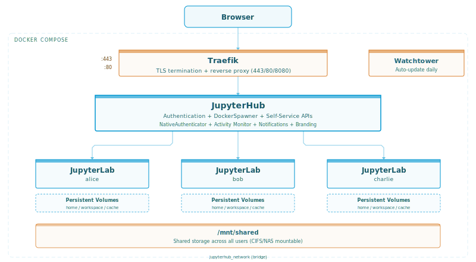

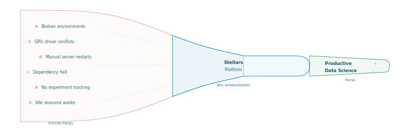


## Two Projects, One Ecosystem

The platform is actually two independent open-source projects that work together.

**[stellars-jupyterhub-ds](https://github.com/stellarshenson/stellars-jupyterhub-ds)** is the orchestration layer. It runs 2,390 lines of custom Python across 27 modules in a package called `stellars_hub`, backed by 65+ automated tests. It handles multi-user authentication, container spawning, GPU detection, admin tools, and platform management. Think of it as the control plane - it decides who gets what, monitors usage, and keeps everything running. The Hub exposes 14 custom API handlers beyond vanilla JupyterHub, configured through 29 environment variables, and serves 23 custom HTML templates with 1,677 lines of hand-written CSS.

**[stellars-jupyterlab-ds](https://github.com/stellarshenson/stellars-jupyterlab-ds)** is the workspace that each user actually sees. It's built from a 606-line multi-stage Dockerfile on top of `nvidia/cuda:13.0.2-base-ubuntu24.04` and ships with JupyterLab 4.5.1, Python 3.12 via Miniforge, 30 OS packages, 43 pip dependencies, and 21 JupyterLab extensions. When JupyterHub spawns a container for a user, this is the image it pulls.

Both can run independently. You can use the JupyterLab image as a standalone single-user workstation. You can use the JupyterHub orchestrator with a different notebook image entirely. But together they form a cohesive platform where everything is pre-integrated and ready to go. Teams across industries - from manufacturing to finance to academic research - run this combination in production today.

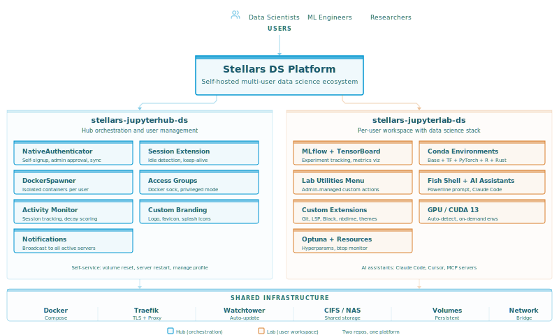

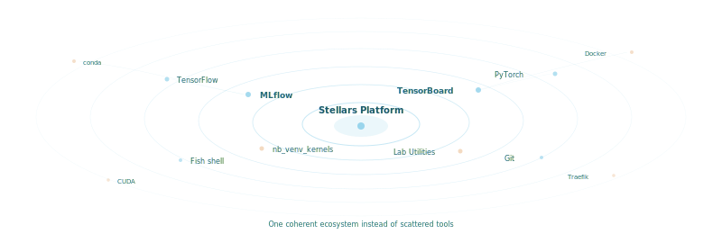

## What Vanilla Gives You (And What It Doesn't)

Stock JupyterHub is an excellent multi-user notebook server. It handles authentication, spawns notebook containers, and provides basic admin controls. Stock JupyterLab is a solid browser-based IDE with a notebook interface. Both are good foundations. Neither knows anything about data science workflows.

Here's what I added on top of each.

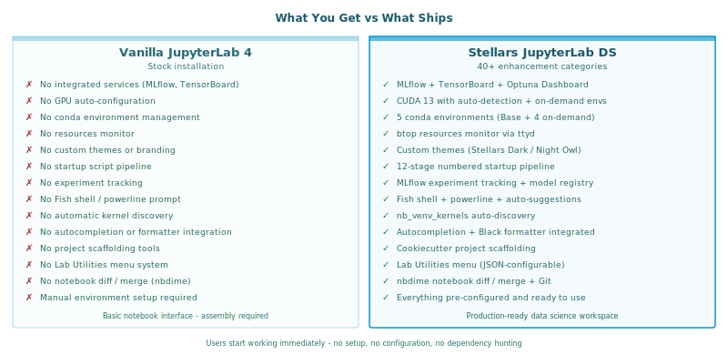

**On the Hub side** - everything beyond stock JupyterHub 5:
- Self-service server controls with selective volume reset and container restart
- Session extension for the idle culler (users buy themselves extra hours, with silent truncation at the limit)
- Activity Monitor with exponential decay scoring (72-hour half-life) and real-time Docker stats
- Notification broadcast to all active JupyterLab sessions (6 types, 140-char limit, temporary 5-minute API tokens)
- GPU auto-detection (spawns an ephemeral CUDA container at startup, tests `nvidia-smi`, cleans up)
- Group-based Docker access control (`docker-sock` and `docker-privileged`, auto-recreating if deleted)
- Mnemonic password generation via xkcdpass (e.g., `storm-apple-ocean`) with credentials modal
- Custom branding (logo, favicon, JupyterLab icons - all configurable via environment variables)
- NativeAuthenticator with authorization protection and automatic user rename sync
- Settings page showing all 29 configuration variables for deployment debugging

**On the Lab side** - everything beyond stock JupyterLab 4:
- CUDA 13.0.2 base image with 4 on-demand conda environments (TensorFlow 2.18+, PyTorch 2.4+, R, Rust)
- 5 integrated background services: MLflow, TensorBoard, Resources Monitor, Optuna Dashboard, Server Proxy
- 21 JupyterLab extensions including custom kernel auto-discovery (`nb_venv_kernels`), two IntelliJ-inspired dark themes, Git integration, Black formatter, notebook execution timing
- Lab Utilities - 15 helper scripts across 5 areas (environment install, Git workflows, AI assistants, project scaffolding, Docker CLI)
- Custom entrypoints for both admin-managed and user-defined startup scripts, with success/failure notifications delivered to the JupyterLab UI
- Fish shell with custom powerline prompt showing conda environment, git branch, and GPU status
- AI coding assistant installers (Claude Code, Cursor, Gemini CLI, OpenAI Codex)
- Docker MCP Gateway and Buildx plugin compiled from source in the builder stage

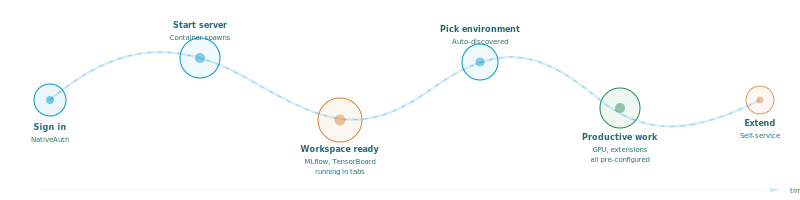


## What Users Actually Get

When a team member logs in and starts their server, they land in a full data science workspace. Not a blank JupyterLab with a Python kernel and nothing else - a workspace where every common friction point has been addressed.

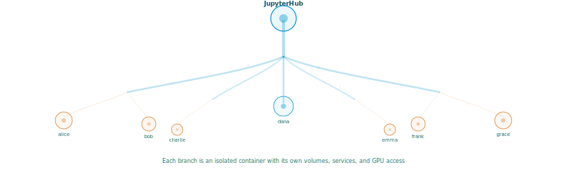

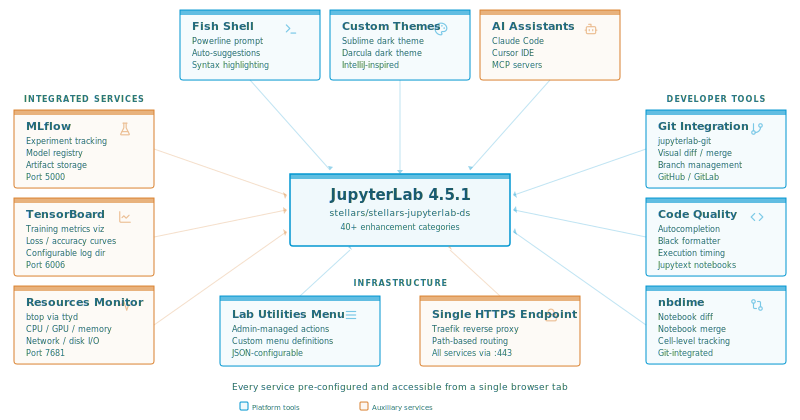

The 40+ enhancement categories span the entire workflow.

**Environment management.** This is where the platform departs most dramatically from vanilla JupyterLab. The strategy has two layers - and they work together.

The first layer is **conda** - it separates the data science runtime from the operating system entirely. The base conda environment ships with NumPy, Pandas, Polars, SciPy, Scikit-learn, and Matplotlib - 43 packages ready on first login. For deep learning, TensorFlow and PyTorch live in separate on-demand conda environments that avoid dependency conflicts between frameworks. This keeps the OS clean and the data science stack isolated.

The second layer is **uv-based local virtual environments** for individual projects. The platform promotes modern Python packaging through its [copier-data-science](https://github.com/stellarshenson/copier-data-science) project template - accessible via Lab Utilities - which scaffolds new projects with a standardized structure including a local `.venv` managed by `uv`. Each project gets its own isolated environment with pinned dependencies, reproducible across team members. `uv` is pre-installed and dramatically faster than pip for environment creation and package installation.

The glue that makes this seamless is `nb_venv_kernels` - a custom extension that scans the entire system for conda, venv, and uv environments and registers each as a Jupyter kernel automatically. Create an environment anywhere and it appears as a selectable kernel in JupyterLab within seconds. No manual kernel registration, no JSON spec files, no restarts. The launcher integrates environment selection with project navigation, so switching between projects and their associated environments is seamless. JupyterLab's built-in plugins for conda and pip management let users install packages directly from the UI.

All local environments persist in user volumes between server image refreshes. When the admin pushes a new image via Watchtower, user-created conda environments, uv venvs, and project directories survive because they live on persistent volumes. The base image gets updated, user customizations stay intact.

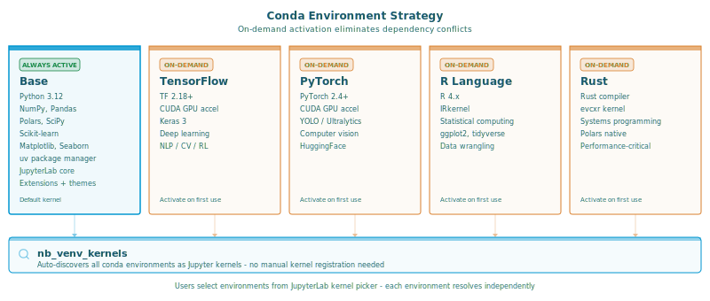

**Integrated services.** Every user gets their own local instances of MLflow, TensorBoard, Resources Monitor, and Optuna Dashboard running inside their container. Not shared services - personal ones. This eliminates conflicts entirely. MLflow tracks experiments to a per-user SQLite database with local artifact storage. TensorBoard reads from the user's own log directory. The resources monitor shows that user's container stats. Each service opens as a tab inside JupyterLab through the launcher, so users never leave the notebook interface. All services route through a per-user Traefik instance at a single HTTPS endpoint with path-based routing. No port conflicts, no configuration, no shared state.

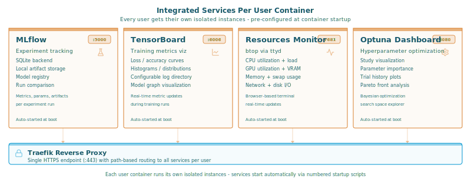

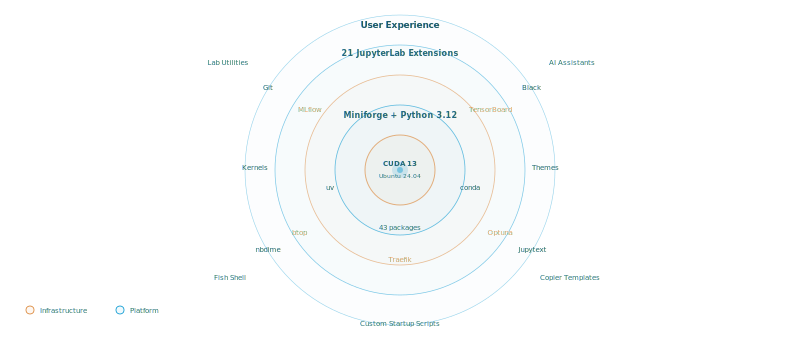

**Developer experience.** Full Git integration in the sidebar. Black formatter for one-click code formatting. Notebook diffing and merging with nbdime. Execution timing on every cell. Jupytext for version-controlling notebooks as plain Python files. Fish shell with a custom powerline prompt that displays the active conda environment, current git branch, and GPU status. One-command installers for Claude Code, Cursor, Gemini CLI, and OpenAI Codex.

**Visual polish.** Two custom dark themes - Sublime and Darcula, both inspired by IntelliJ's design language - with fixed scrollbar rendering that vanilla JupyterLab still gets wrong in dark mode.

**Custom startup scripts.** Both admins and users have dedicated entrypoints for startup automation. Admins deploy team-wide scripts to `/mnt/shared/start-platform.d/` for configuration that applies to every user. Users drop personal scripts into `~/.local/start-platform.d/` for their own setup. Both execute automatically on server start, and the system delivers success or failure notifications directly to the JupyterLab UI when they complete.

## Self-Service Changes Everything

The single most impactful design decision was making the platform self-service. Users don't file tickets. They don't wait for an admin to restart their server. They don't need SSH access or Docker knowledge.

The home page gives each user three buttons: **Start**, **Stop**, and **Restart**. Below that sits a session timer - a thin progress bar showing how long until the idle culler reclaims their server. If they need more time, they click **Extend** and add hours to their session. The system silently truncates requests that exceed the maximum, returning a warning instead of an error. No admin involvement.

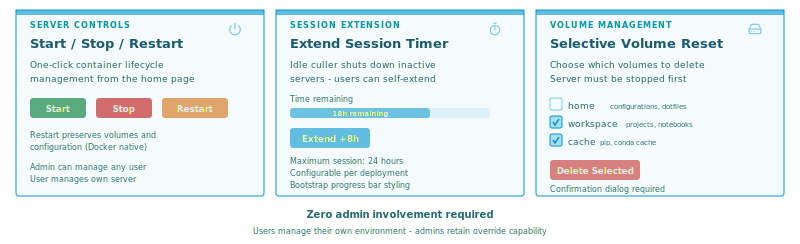

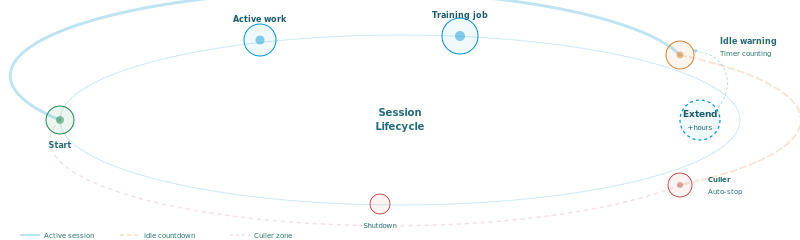

When something goes wrong - a corrupted pip cache, a broken Conda environment, a home directory full of failed experiments - users can selectively reset their own volumes. Home directory, workspace, cache. Pick which ones to wipe, confirm, and start fresh. This alone eliminated roughly half of the support requests we used to get.


## Notification Broadcast

When you need to reach everyone working on the platform - planned maintenance, a shared dataset update, a GPU driver change - the notification system delivers messages directly inside every active JupyterLab session.

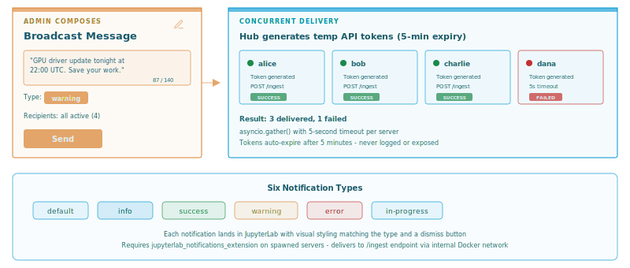

The admin composes a short message (140-character limit, deliberately Twitter-brief) and picks a notification type: info for routine updates, warning for upcoming disruptions, error for urgent issues, success for resolved problems, or in-progress for ongoing work. The system queries all active spawners, generates a temporary API token for each recipient (5-minute expiry for security), and delivers notifications concurrently via `asyncio.gather()` with a 5-second timeout per server.

Each notification lands in the user's JupyterLab with a dismiss button and visual styling matching the type. Admins can target all active servers or select specific recipients from a checkbox list. After delivery, a status table shows exactly which users received the message and which failed, with per-server error details. One-line logging captures every broadcast for audit.

The system requires the `jupyterlab_notifications_extension` on spawned servers - a companion JupyterLab extension that exposes an `/ingest` endpoint for receiving notifications. The full endpoint path accounts for JupyterHub's base URL and per-user routing: `http://jupyterlab-{username}:8888{base_url}jupyterlab-notifications-extension/ingest`.


## GPU Auto-Detection

GPU support is handled at both layers. The Hub detects availability at startup with a three-position switch: disabled, enabled, or auto-detect. Auto-detect spawns a temporary container from `nvidia/cuda:13.0.2-base-ubuntu24.04`, runs `nvidia-smi`, and checks if it succeeds. If GPUs are present, every user container gets NVIDIA device passthrough via Docker's `device_requests`. The test container is force-removed after the check regardless of outcome.

The Lab image is built on the same CUDA 13.0.2 base, so GPU libraries are always in the image. The on-demand TensorFlow and PyTorch environments come pre-configured for GPU acceleration. This means the same images work on a developer's laptop without a GPU, a staging server, and a production machine with four NVIDIA A100s. Zero manual configuration at either layer.


## Configuration, Not Code

Both platforms are designed to be configured entirely through environment variables and compose override files - no code changes needed for any deployment.

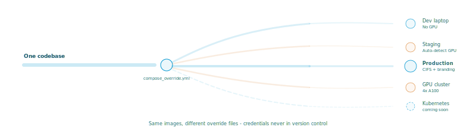

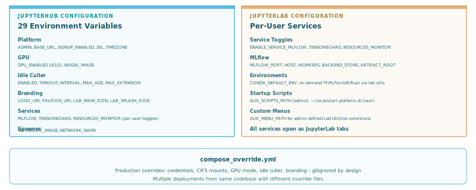

The Hub accepts 29 environment variables controlling everything from admin username and GPU mode to idle culler timeouts and branding URIs. The Lab image uses service toggles (`JUPYTERHUB_SERVICE_MLFLOW`, `JUPYTERHUB_SERVICE_TENSORBOARD`, `JUPYTERHUB_SERVICE_RESOURCES_MONITOR`) to enable or disable background services per deployment. Branding is configurable through four URI variables that accept either local `file://` paths or external `http(s)://` URLs for logos, favicons, and JupyterLab icons.

For production deployments, create a `compose_override.yml` alongside the main `compose.yml`. Override environment variables, add CIFS/NAS mounts for shared storage, change the notebook image, enable the idle culler, set a custom timezone. The override file is gitignored by design, so deployment-specific credentials and settings never end up in version control. Multiple deployments can run from the same codebase with different override files.

## Keeping an Eye on Things

A self-service platform still needs oversight. Admins need to know who's using the platform, how heavily, and whether anyone's server has been idle for three days eating up memory.

The **Activity Monitor** is an admin-only dashboard that shows every user at a glance. Each row displays a three-state status indicator (green for active, amber for idle, red for offline), real-time CPU and memory usage pulled from the Docker stats API via a thread pool executor, volume sizes with per-volume tooltips, time remaining on the idle timer, authorization status, and a historical activity score.

The activity score uses exponential decay with a configurable half-life (default: 72 hours). The formula is straightforward: `weight = exp(-lambda * age_hours)` where `lambda = ln(2) / half_life`. Recent activity weighs more. A user who worked intensely three days ago but hasn't logged in since will see their score gradually fade. The score is displayed as a five-segment color-coded bar - green for high engagement, amber for moderate, red for low.

The Activity Monitor also runs an independent background sampler as a JupyterHub managed service. It samples all users - active, idle, and offline - at a configurable interval (default: every 10 minutes), recording activity snapshots to a separate SQLite database to avoid lock contention with JupyterHub's main database.

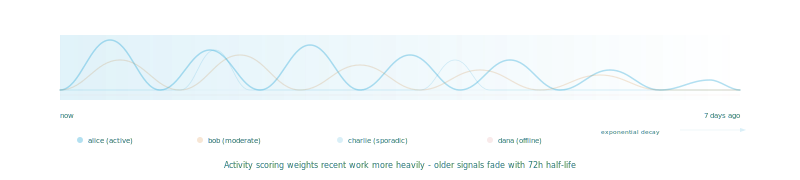

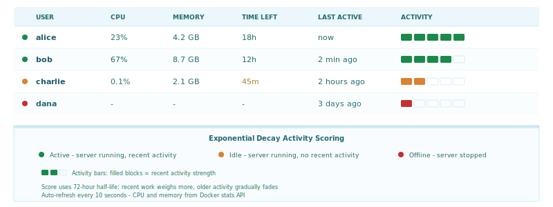

## The Little Things That Matter

Some features don't sound impressive in a bullet list but make a real difference in daily use.

**Mnemonic passwords.** When admins create user accounts through the admin panel, the platform generates a memorable password via xkcdpass (e.g., `storm-apple-ocean`), hashes it with bcrypt, and caches the plaintext for 5 minutes. The credentials appear in a modal with per-row copy icons and a download button.

**Group-based Docker access.** Two protected groups - `docker-sock` for Docker API access and `docker-privileged` for full privileged mode. The pre-spawn hook checks group membership before every container launch. Both groups auto-recreate if accidentally deleted from the admin panel.

**Shared storage.** A shared volume is mounted at `/mnt/shared` in every container. Teams use it for common datasets, pre-trained models, shared startup scripts, and custom Lab Utilities extensions. It can be backed by local storage or a NAS mount via CIFS.

**Lab Utilities menu.** A YAML-driven interactive dialog system inside each container with 15 helper scripts across 5 categories: conda environment installation, Git workflows, AI assistant setup, project scaffolding, and Docker tools. Admins extend it by deploying scripts to the shared volume.

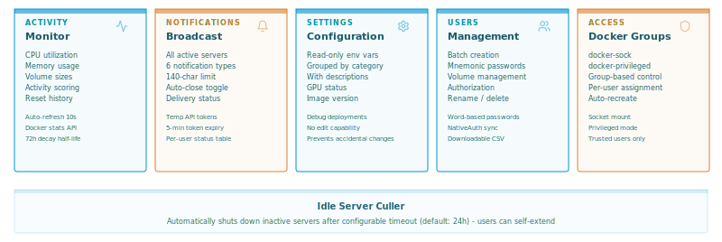

## Running It

The deployment story is deliberately simple. Clone the repository. Run `./start.sh`. The platform generates self-signed TLS certificates, starts all services, and serves JupyterHub behind Traefik. Register as the admin user and you're done.

The entire platform is defined in a single `compose.yml`:

```yaml
services:

  traefik:
    image: traefik:latest
    ports:
      - "80:80"
      - "443:443"
      - "8080:8080"
    volumes:
      - /var/run/docker.sock:/var/run/docker.sock:ro
      - jupyterhub_certs:/mnt/certs

  jupyterhub:
    image: stellars/stellars-jupyterhub-ds:latest
    volumes:
      - ./config/jupyterhub_config.py:/srv/jupyterhub/jupyterhub_config.py:ro
      - /var/run/docker.sock:/var/run/docker.sock:rw
      - jupyterhub_data:/data
      - jupyterhub_shared:/mnt/shared
    environment:
      - JUPYTERHUB_ADMIN=admin
      - JUPYTERHUB_GPU_ENABLED=2          # auto-detect
      - JUPYTERHUB_IDLE_CULLER_ENABLED=0   # opt-in
      - JUPYTERHUB_IDLE_CULLER_MAX_EXTENSION=24
      - JUPYTERHUB_NOTEBOOK_IMAGE=stellars/stellars-jupyterlab-ds:latest
      - JUPYTERHUB_SERVICE_MLFLOW=1
      - JUPYTERHUB_SERVICE_TENSORBOARD=1

  watchtower:
    image: nickfedor/watchtower:latest
    command: --cleanup --schedule "0 0 0 * * *"
    volumes:
      - /var/run/docker.sock:/var/run/docker.sock:rw

volumes:
  jupyterhub_data:
  jupyterhub_certs:
  jupyterhub_shared:

networks:
  jupyterhub_network:
```

Three services. A handful of environment variables. That's the entire infrastructure. For production, override the defaults in a `compose_override.yml` file - custom image name, GPU mode, idle culler settings, NAS mounts, branding. The override file is gitignored by design, so deployment-specific credentials never end up in version control.

Updates happen automatically. Watchtower checks DockerHub daily for new images and rolls them out with zero downtime.

## What We Learned

**Users will reset their environments more often than you expect.** Making it easy and self-service wasn't a luxury - it was a necessity. The old process of asking an admin to clean up a broken environment took hours. Now it takes seconds.

**Idle culling needs a safety valve.** Automatically shutting down inactive servers is essential for resource management, but it infuriates users who leave a long training job running overnight. Session extension solved this elegantly.

**Activity monitoring changes behavior.** Once the activity dashboard existed, team leads started using it in standups. Not as a surveillance tool, but as a conversation starter. "I see three people haven't logged in this week - do they need help getting started?"

**Separate the orchestration from the workspace.** Making the Hub and Lab independent projects was the right call. The Hub rarely changes - it's infrastructure. The Lab image evolves constantly as new libraries, extensions, and tools get added. Different release cadences, different concerns.

**Simple beats clever.** Docker Compose with three services and a handful of configuration files turned out to be exactly enough for single-server deployments. The platform runs on one machine, serves a team comfortably, and the entire configuration fits in your head.

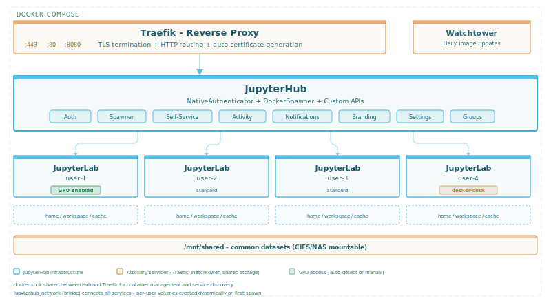

## What's Next: Kubernetes

The current Docker Compose deployment works well for single-server teams, but the next chapter is Kubernetes. The same JupyterHub orchestration and JupyterLab workspace images are being adapted for Helm-based deployment on Kubernetes clusters - enabling elastic scaling, resource quotas per user, node affinity for GPU workloads, and multi-node setups for larger organizations. The goal remains the same: friction-free data science, just at a larger scale.

## Try It

Both projects are open source:

- **Hub** - [stellarshenson/stellars-jupyterhub-ds](https://github.com/stellarshenson/stellars-jupyterhub-ds) on GitHub, [stellars/stellars-jupyterhub-ds](https://hub.docker.com/r/stellars/stellars-jupyterhub-ds) on DockerHub
- **Lab** - [stellarshenson/stellars-jupyterlab-ds](https://github.com/stellarshenson/stellars-jupyterlab-ds) on GitHub, [stellars/stellars-jupyterlab-ds](https://hub.docker.com/r/stellars/stellars-jupyterlab-ds) on DockerHub

A typical deployment takes about fifteen minutes from clone to first login. The Lab image works standalone too - run it with `docker compose up` for a single-user data science workstation with GPU support, MLflow, TensorBoard, and the full stack.

If your data science team is still sharing a single server with Conda environments held together by hope, this might be worth a look.

---

*Stellars Henson is a data scientist specializing in predictive maintenance and AI solutions. The Stellars platform is developed and maintained as part of the [Kolomolo](https://kolomolo.com) ecosystem.*
